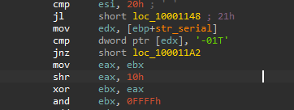
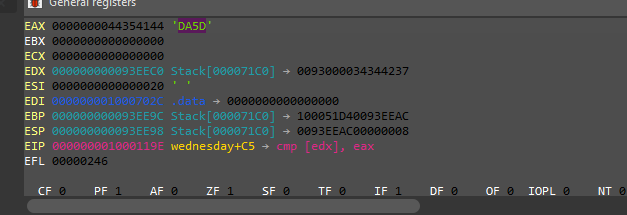
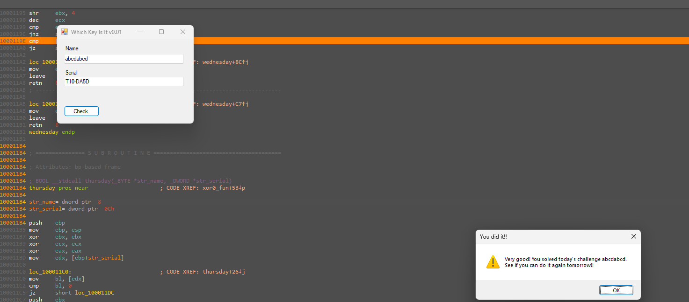

# WeekDaysBased Crackme — Wednesday sub-challenge (machine-specific `T10-` suffix)

> One of seven day-dispatched sub-challenges inside the same binary. The Wednesday branch requires a serial of the form `T10-XXXX`, where the four-character suffix is derived from the username **and per-machine state (via `cpuid`)** — so no portable keygen exists. The suffix was recovered dynamically at the comparison.

## Metadata

| Field        | Value |
|--------------|-------|
| Source       | Local archive — `xor0_crackme_1` (WeekDaysBased Crackme) |
| Language     | .NET managed shell (`WhichKeyIsIt`) + native C/C++ helper (`helper.dll`) |
| Architecture | x86 (32-bit) |
| Platform     | Windows |
| Branch       | `wednesday` handler (dispatch index 2) |
| Difficulty   | 3.0 / 6 (self-assessed) |
| Date solved  | 2026-09-24 |
| Time spent   | ~30 min |
| Tools        | dnSpy, IDA Pro (local Windows debugger) |
| Solve type   | password (dynamic recovery; machine-specific) |

## 1. Goal

With the `wednesday` branch active, a name plus a serial `T10-XXXX` (with the correct four-char suffix) prints the success message. The objective is that suffix for a chosen name.

## 2. Host recap

The managed shell forwards to `helper.dll!xor0_fun`, dispatched on `wDayOfWeek`. This writeup covers the `wednesday` handler.

## 3. Static Analysis

The handler first enforces the `T10-` prefix, then derives and compares the suffix:

```asm
mov  edx, [ebp+str_serial]
cmp  dword ptr [edx], '-01T'   ; first 4 bytes == "T10-"  (LE dword 0x2D303154)
jnz  fail
...                            ; per-character mixing over the username:
shl  eax, 8
add  eax, ebx
shr  ebx, 4
...                            ; loop, folding in name bytes and cpuid-derived state
cmp  [edx], eax                ; serial-suffix bytes == computed 4 chars
jz   success
fail:
mov  eax, 0
```


![The suffix comparison `cmp [edx], eax`](02_comparison.png)

The suffix is produced by a rolling computation over the username combined with machine-specific state obtained from `cpuid`. Because `cpuid` output differs per CPU, the required suffix is **not portable** — the same username yields a different suffix on another machine — which is why a generalized keygen is not possible and the value is recovered at runtime instead.

## 4. Solution (dynamic recovery)

Breaking on `cmp [edx], eax` reveals the expected suffix in `EAX`. For the username `abcdabcd` on the analysis machine, `EAX = 0x44354144`, whose bytes are ASCII `D A 5 D`:



So the accepted serial for `abcdabcd` (on this machine) is:

- **Serial:** `T10-DA5D`



> Machine caveat: `T10-DA5D` is the valid serial for `abcdabcd` **on this CPU**. On different hardware the `cpuid`-tainted suffix changes; the recovery procedure (break on the compare, read `EAX`) is what generalizes, not the value.

## 5. Key Takeaways

- **`cpuid` in a key check means machine binding.** When per-CPU state feeds the expected value, a static keygen cannot be portable; the right move is to read the computed target at the comparison for the specific machine/input.
- **Prefix gate then computed tail.** A fixed `cmp dword [serial], 'T10-'` cheaply rejects wrong formats before the expensive derivation — recognizing the two stages focuses the breakpoint on the `cmp [edx], eax` that matters.
- **Read the expected operand, not just the branch.** The suffix `DA5D` is sitting in `EAX` the instant before the compare; dynamic recovery beats reversing a hardware-tainted hash.

## 6. Artifacts

- **Serial (for `abcdabcd`, this machine):** `T10-DA5D`
- **Format:** `T10-` prefix + 4-char suffix derived from username + `cpuid` state
- **Recovery:** break on `cmp [edx], eax`; expected suffix in `EAX` (`0x44354144` = `"DA5D"`)
- **Branch:** `wednesday` handler (dispatch index 2)
- **Binary:** `Binary/WeekDaysBased_Crackme.exe` (+ `helper.dll`)
