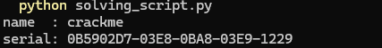
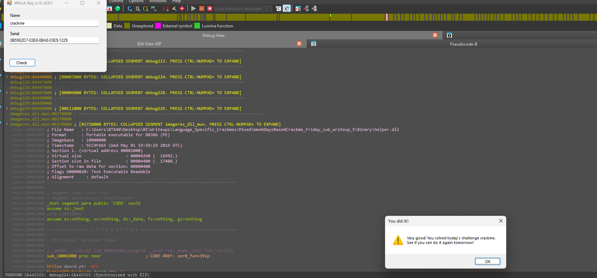

# WeekDaysBased Crackme — Saturday sub-challenge (Adler-32 + numeric constraints, keygen)

> One of seven day-dispatched sub-challenges inside the same binary. The Saturday branch builds a GUID-shaped serial `AAAAAAAA-BBBB-CCCC-DDDD-EEEE`: the first group is Adler-32 of the username, and the four 16-bit groups must each sit in `[1000, 9999]` and satisfy two small XOR/multiply relations. All of it is forward-computable, so this is a full keygen.

## Metadata

| Field        | Value |
|--------------|-------|
| Source       | Local archive — `xor0_crackme_1` (WeekDaysBased Crackme) |
| Language     | .NET managed shell (`WhichKeyIsIt`) + native C/C++ helper (`helper.dll`) |
| Architecture | x86 (32-bit) |
| Platform     | Windows |
| Branch       | `saturday` handler (dispatch index 5) |
| Difficulty   | 3.5 / 6 (self-assessed) |
| Quality      | 4.0 / 6 (self-assessed) |
| Date solved  | 2026-10-03 |
| Time spent   | ~1h |
| Tools        | dnSpy, IDA Pro, Python (zlib) |
| Solve type   | keygen |

## 1. Goal

With the `saturday` branch active, a name plus a correctly-formed serial prints the success message. The objective is a general rule for the serial.

## 2. Host recap

The managed shell forwards to `helper.dll!xor0_fun`, dispatched on `wDayOfWeek`. This writeup covers the `saturday` handler.

## 3. Static Analysis

The handler hashes the name, strips dashes from the serial, decodes the hex, and runs a chain of checks:

```asm
call Adler_32_func            ; eax = Adler32(1, strlen(name), name)  = Adler32(name)
push eax                      ; keep it
; strip '-' from the serial into str_serial (skip 0x2D, copy the rest)
strlen(str_serial) ; xor ecx, 24 / jnz fail     ; de-dashed length must be 24 hex chars (12 bytes)
Hex_Decoder(str_serial -> mem_reg)              ; 24 hex -> 12 bytes

mov eax, [mem_reg]            ; first 4 decoded bytes
pop ebx ; bswap ebx           ; ebx = byteswap(Adler32(name))
xor eax, ebx / jnz fail       ; decoded[0..3] (big-endian) == Adler32(name)

; group B: bytes [4..5], byte-swapped to a big-endian 16-bit value
mov ax,[edi+4] ; xchg ah,al ; cmp eax,3E8h / jl fail ; cmp eax,270Fh / jg fail   ; 1000..9999
; group C: bytes [6..7]
mov bx,[edi+6] ; xchg bh,bl ; cmp ebx,3E8h / jl fail ; cmp ebx,270Fh / jg fail   ; 1000..9999
mul ebx ; and eax,7FFFh ; xor eax,(B^C) / jnz fail    ; (B*C) & 0x7FFF == B ^ C

; group D: bytes [8..9]  (1000..9999)
; group E: bytes [10..11] (1000..9999)
mul ebx ; shr eax,0Ah ; xor eax,(D^E) / jnz fail      ; (D*E) >> 10 == D ^ E

; original (dashed) serial must have '-' at 8, 13, 18, 23
cmp [eax+8],  '-' / jnz fail
cmp [eax+0Dh],'-' / jnz fail
cmp [eax+12h],'-' / jnz fail
cmp [eax+17h],'-' / jnz fail
mov eax, 1                    ; success
```

**Adler-32 recognition.** `Adler_32_func` is Adler-32, recognized from its constants and shape:
- modulo `65521` (`0xFFF1`), block size `5552` (`0x15B0`)
- two running sums: `a += byte; b += a` (both `% 65521`)
- result = `(b << 16) | a` (32-bit)

### The constraints

Serial layout is `AAAAAAAA-BBBB-CCCC-DDDD-EEEE` (8-4-4-4-4 hex; dashes at indices 8, 13, 18, 23). After removing dashes it is 24 hex chars = 12 bytes, read as five big-endian fields:

1. Length: de-dashed serial is exactly 24 hex chars (12 bytes).
2. `AAAAAAAA` (bytes 0–3, big-endian) == `Adler32(name)`.
3. `BBBB` (bytes 4–5) and `CCCC` (bytes 6–7), each a 16-bit value in `[1000, 9999]`.
4. `(B * C) & 0x7FFF == B ^ C`.
5. `DDDD` (bytes 8–9) and `EEEE` (bytes 10–11), each in `[1000, 9999]`.
6. `(D * E) >> 10 == D ^ E`.
7. Dashes present at positions 8, 13, 18, 23 of the entered serial.

## 4. The Core Insight

Nothing here is one-way. `Adler32(name)` is computed forward, and the two relations over `(B,C)` and `(D,E)` are tiny — both operands live in `[1000, 9999]`, so a brute-force search finds a satisfying pair almost instantly. Fix the first group from the name, solve the two puzzles once, and format. That makes Saturday a proper keygen for any username.

## 5. Solution (keygen)

`solving_script.py` (searches the two pairs, computes the Adler-32, formats the serial):

```python
import zlib
import sys

def find(second):
    for X in range(1000, 10000):
        for Y in range(1000, 10000):
            r = (X * Y >> 10) if second else (X * Y & 0x7FFF)
            if (X ^ Y ^ r) == 0:
                return X, Y
    return None

B, C = find(False)   # BBBB, CCCC  ->  B ^ C ^ ((B*C) & 0x7FFF) == 0
D, E = find(True)    # DDDD, EEEE  ->  D ^ E ^ ((D*E) >> 10)   == 0

name = sys.argv[1].encode() if len(sys.argv) > 1 else b"crackme"
A = zlib.adler32(name) & 0xFFFFFFFF
serial = "%08X-%04X-%04X-%04X-%04X" % (A, B, C, D, E)
print("name  :", name.decode())
print("serial:", serial)
```

For name `crackme` it produces `0B5902D7-03E8-0BA8-03E9-1229`:



- **Name:** `crackme`
- **Serial:** `0B5902D7-03E8-0BA8-03E9-1229`



Checks, for the record: `Adler32("crackme") = 0x0B5902D7`; `B=0x03E8 (1000)`, `C=0x0BA8 (2984)` give `(B*C)&0x7FFF = 0x840 = B^C`; `D=0x03E9 (1001)`, `E=0x1229 (4649)` give `(D*E)>>10 = 0x11C0 = D^E`.

## 6. Key Takeaways

- **Adler-32 on sight.** Modulo `65521` (`0xFFF1`) with block size `5552` (`0x15B0`), the twin `a += byte; b += a` sums, and a `(b << 16) | a` result are Adler-32. Recognize it and treat it as a black box.
- **Read the byte order.** `bswap` and `xchg ah, al` mean the fields are compared big-endian; decoding them little-endian would produce the wrong values and a lot of confusion. Track the endianness at each field.
- **Small ranges invite brute force.** Each numeric field is bounded to `[1000, 9999]`, so the two constraints are solved by a trivial double loop rather than any algebra.
- **Forward-computable ⇒ keygen.** With `Adler32(name)` computed directly and the numeric puzzles solved once, every username has a serial — a clean keygen, not a dynamic recovery.

## 7. Artifacts

- **Keygen:** `solving_script.py` (in this folder) — `serial = "%08X-%04X-%04X-%04X-%04X" % (Adler32(name), B, C, D, E)`
- **Verified pair:** `crackme` / `0B5902D7-03E8-0BA8-03E9-1229`
- **Serial format:** `AAAAAAAA-BBBB-CCCC-DDDD-EEEE` (dashes at 8, 13, 18, 23); de-dashed = 24 hex = 12 bytes, big-endian fields
- **Constraints:** `A = Adler32(name)`; `B,C,D,E ∈ [1000,9999]`; `(B*C)&0x7FFF == B^C`; `(D*E)>>10 == D^E`
- **Hash:** Adler-32 (`mod 65521`, block `5552`, result `(b<<16)|a`)
- **Branch:** `saturday` handler (dispatch index 5)
- **Binary:** `Binary/WeekDaysBased_Crackme.exe` (+ `helper.dll`)
