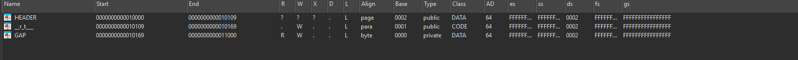
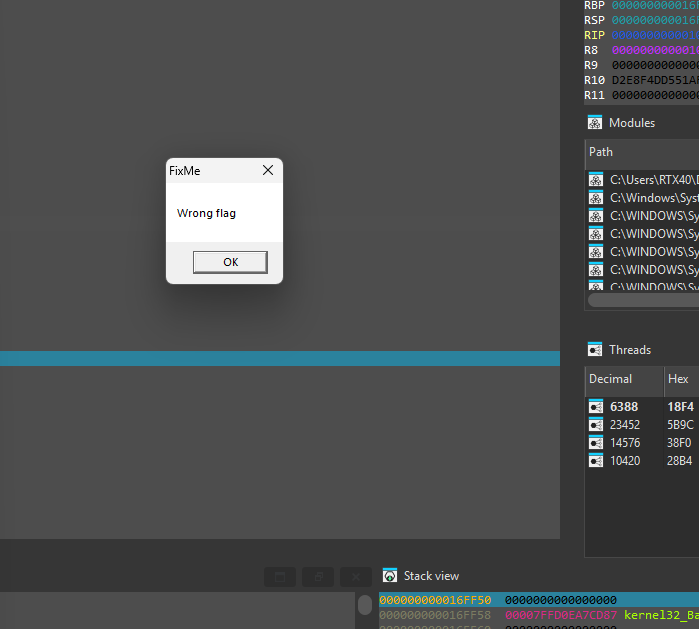
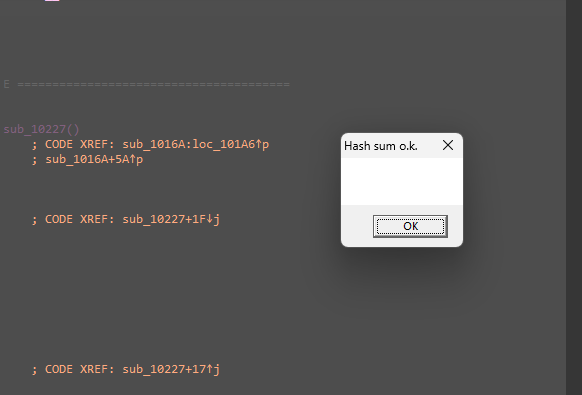

# Saenro CTF — Tiny PE64, Patch the Hardcoded Constant

> A 666-byte hand-crafted PE64 with no normal sections. It computes a hash over its embedded data and gates success on a single XOR chain equaling zero. One operand in that chain is a hardcoded constant the binary ships *wrong* — the failure dialog is even titled "FixMe" — so the intended solve is to patch that constant to the value the equation demands. The real trap is endianness.

## Metadata

| Field        | Value |
|--------------|-------|
| Source       | Local archive — Saenro CTF v1 (`saenro-ctf-v1.exe`) |
| Author       | saenro |
| Language     | x86-64 (hand-crafted tiny PE) |
| Architecture | x86-64 |
| Platform     | Windows (PE64) |
| Difficulty   | 3.5 / 6 (self-assessed) |
| Quality      | 4.5 / 6 (self-assessed) |
| Date solved  | 2026-10-09 |
| Time spent   | ~1–1.5h |
| Tools        | IDA Pro (local Windows debugger), hex editor |
| Solve type   | patch (fix the hardcoded constant) |

## 1. Goal

The program pops a message box. With the shipped binary it shows `FixMe` / "Wrong flag"; the objective is to reach the `Hash sum o.k.` message. The "FixMe" title is the hint — the binary is meant to be fixed.

## 2. Triage / Recon

- **Size:** 666 bytes. This is a hand-assembled PE64, not a compiler-produced one.
- **No standard sections.** There is no `.text` / `.data` / `.rdata`; the segment list is just three entries:
  - `HEADER` — `0x10000–0x10109`
  - `__r_t___` — `0x10109–0x10169`, the CODE segment
  - `GAP` — `0x10169–0x11000`, read/write DATA
- Because code and data are packed tightly, IDA interleaves instructions and `db` bytes; the logic lives in `sub_1016A`.



## 3. Static Analysis

`sub_1016A` runs a custom byte-level hash/transform over the embedded data — a decode loop (`lodsb` / `add` / `rol` / `xor`, calling `sub_10227`), then an accumulation loop (`shl` / `and r9` / `lodsb`) — leaving results in `rbx` and `r10`. The exact mixing doesn't matter for the solve; what matters is the final decision:

```asm
lea   r8, word_1000A
mov   dx, 24Ah
lea   rax, Hash_sum_o_k__          ; "Hash sum o.k. "
...
xor   rbx, [rsi+2]
xor   r10, qword ptr cs:asc_100A8  ; asc_100A8 = hardcoded 8-byte constant
xor   rbx, r10                     ; sets ZF if the whole chain == 0
cmovz r8,  rax                     ; if ZF -> message = "Hash sum o.k."
cmovz rdx, r14
call  cs:User_Message_Box_
```

The success condition is one equation:

```
rbx ⊕ [rsi+2] ⊕ r10 ⊕ asc_100A8 == 0
```

Everything except `asc_100A8` is produced by the hash at runtime. `asc_100A8` is a fixed constant baked into the file — and it ships with the wrong value, which is why the stock binary prints "Wrong flag" under the title "FixMe".



## 4. The Core Insight

There is no need to reverse the hash. The verdict is a single XOR chain with exactly one operand the analyst controls — the hardcoded `asc_100A8`. Capture the other three values at runtime and solve for the constant that makes the chain zero, then patch it in. The "FixMe" dialog confirms that patching is the intended path.

Solving the equation for the unknown:

```
rbx ⊕ [rsi+2] ⊕ r10 ⊕ asc_100A8 == 0
⇒ asc_100A8 = rbx ⊕ [rsi+2] ⊕ r10
```

Captured at the check:

```
rbx ⊕ [rsi+2] = 0x0F16E408D1321553
r10           = 0x697156A9A468AEA0
```

So:

```
asc_100A8 = 0x0F16E408D1321553 ⊕ 0x697156A9A468AEA0 = 0x6667B2A1755ABBF3
```

## 5. Solution (patch) — and the endianness trap

The value `asc_100A8` must equal the **QWORD** `0x6667B2A1755ABBF3`. This is where the hours went: **IDA's debugger displays the loaded QWORD in little-endian, while the static listing shows the bytes in memory order** — the two views are byte-reverses of each other, and mixing them up produces a value that looks right in one window and wrong in the other.

- As a QWORD value: `0x6667B2A1755ABBF3` (reads `66 67 B2 A1 75 5A BB F3` left-to-right).
- In memory, little-endian, the 8 bytes to write at `asc_100A8` are the reverse: `F3 BB 5A 75 A1 B2 67 66`.

Patching those 8 bytes at `asc_100A8` makes the XOR chain evaluate to zero:



## 6. Key Takeaways

- **Little-endian vs. big-endian, concretely.** The debugger shows a QWORD little-endian; the static byte listing shows memory order. A QWORD *value* and its *in-memory bytes* are reverses of each other — decide which representation a window is giving you before you compare or patch. This one detail was the whole difficulty.
- **Solve for the single unknown.** When success is `A ⊕ B ⊕ C ⊕ K == 0` and only `K` is a hardcoded constant, capture `A, B, C` at runtime and set `K = A ⊕ B ⊕ C`. No need to reverse the hash that produced `A, B, C`.
- **Read the hint in the failure text.** A fail dialog literally titled "FixMe" signals the intended solve is a patch, not a keygen.
- **Tiny hand-crafted PEs have no normal sections.** Work from the segment list (`HEADER` / code / `GAP`) and expect IDA to interleave code and data.

## 7. Artifacts

- **Success condition:** `rbx ⊕ [rsi+2] ⊕ r10 ⊕ asc_100A8 == 0` → "Hash sum o.k."
- **Captured at runtime:** `rbx ⊕ [rsi+2] = 0x0F16E408D1321553`; `r10 = 0x697156A9A468AEA0`
- **Required constant:** `asc_100A8 = 0x6667B2A1755ABBF3`
  - memory bytes (little-endian) to patch: `F3 BB 5A 75 A1 B2 67 66`
- **Patch:** overwrite the 8 bytes at `asc_100A8` with the little-endian form above
- **Segments:** `HEADER` (0x10000), `__r_t___` code (0x10109), `GAP` data (0x10169)
- **Binary:** `Binary/saenro-ctf-v1.exe`
