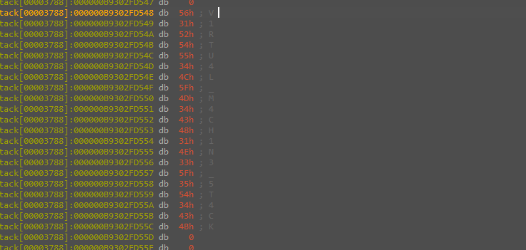
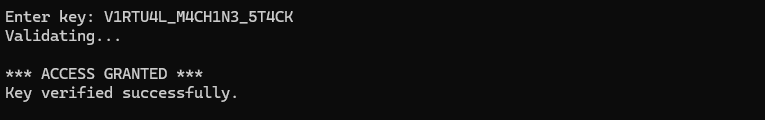

# Layered Anti-Debug Key Validator

> A key checker that never derives anything from the input — it decrypts a secret from three external layered `.bin` files into the heap and does a plain byte-for-byte compare. Solved dynamically by defeating the anti-debug, breakpointing the compare, and reading the 21-byte plaintext key out of memory.

## Metadata

| Field        | Value |
|--------------|-------|
| Source       | Local archive — `Language_Specific_Crackmes/C_C++` |
| Author       | unknown |
| Language     | C/C++ |
| Architecture | x86-64 |
| Platform     | Windows (console) |
| Difficulty   | ~4.5 / 6 (self-assessed) |
| Quality      | 5 / 6 (self-assessed) |
| Date solved  | 2026-09-07 |
| Time spent   | ~2h |
| Tools        | IDA Pro (Hex-Rays), x64dbg, ScyllaHide/TitanHide, DIE |
| Solve type   | password (recovered from memory) |

## 1. Goal

The program prints `Enter key:` and reads a single line. It validates that line against a secret it loads and decrypts from three external files, then prints:

```
*** ACCESS GRANTED ***      (success)
*** ACCESS DENIED ***       (wrong key)
Access denied.              (anti-debug tripped, before validation even runs)
```

The objective is to recover the accepted key.

## 2. Triage / Recon

- **File type / compiler:** PE32+ (x86-64), MSVC, console subsystem. Not packed.
- **Hidden imports:** the interesting APIs are not in a normal import table. `Get_Module_Handles` resolves them at runtime from `ntdll.dll`, `kernel32.dll`, and `advapi32.dll` into an 80-byte function-pointer struct (`context_ptr`): `NtQueryInformationProcess`, `NtSetInformationThread`, `CheckRemoteDebuggerPresent`, `IsDebuggerPresent`, `OpenProcess`, `CloseHandle`. Resolving anti-debug APIs dynamically and calling through a struct keeps them off the IAT, so the anti-analysis surface is that struct rather than the imports view.
- **External data:** the binary builds three paths relative to its own directory and loads them as "verification layers":
  - `j\d1.bin` → `buf`
  - `d\d2.bin` → `buf_1`
  - `k\d3.bin` → `buf_2`
  - DIE on all three returns `unknown` — no recognizable format or signature; they are encrypted/high-entropy blobs, decoded only at runtime.
- **Strings:** unlike some crackmes, the status strings here are plaintext (`Loading verification data...`, `Decoding verification layers...`, `ACCESS GRANTED`, etc.), which makes the phase boundaries easy to follow.
- **First run behavior:** prints `Loading verification data...` → `Decoding verification layers...` → `Initializing anti-debug protections...` → `Enter key:`. Launched under a naive debugger it dies early with `Access denied.`

## 3. Static Analysis

Annotated `main` (cleaned from Hex-Rays):

```c
SetProcessDEPPolicy(1);
Get_Module_Handles(context_ptr);      // resolve nt/kernel32/advapi32 API pointers into context_ptr
Calls_NTQIP_17_0_0(context_ptr);      // ThreadHideFromDebugger (info class 0x11 == 17) -> unhook from debugger
Anti_Debugging_Func_(context_ptr);    // #1 anti-debug gate
if (debugger_detected) { print("Access denied.\n"); return 1; }

GetModuleFileNameA(NULL, Filename, 0x104);   // own path
truncate_after_last_backslash(Filename);     // sub_..2B50(Filename, '\\'=92)

// build layer paths under the exe's own directory
sprintf(Dest,   "%sj\\d1.bin", Filename);
sprintf(Dest_1, "%sd\\d2.bin", Filename);
sprintf(Dest_2, "%sk\\d3.bin", Filename);

Loader_Func(buf,   Dest);     // load j\d1.bin
Loader_Func(buf_1, Dest_1);   // load d\d2.bin
Loader_Func(buf_2, Dest_2);   // load k\d3.bin   <-- holds the key after decode

Decoder_Func(buf, 0);         // decrypt the layered verification data
sub_..1A40(buf);
Integrity_Checker(buf);       // detects any byte modification of the layers (anti-patch)

Anti_Debugging_Func_(context_ptr);   // #2 anti-debug gate
print("Enter key: ");
fgets(user_input, 256, stdin);

// ----- trailing-whitespace trim via bitmask -----
uint64_t ws = 0x100002400;            // bits 10,13,32 set -> LF(\n)=10, CR(\r)=13, SPACE=32
while (c = user_input[len-1], c <= 32 && _bittest64(&ws, c)) {
    user_input[--len] = 0;            // strip trailing LF/CR/SPACE
}

Anti_Debugging_Func_(context_ptr);   // #3 anti-debug gate

// ----- length gate -----
// length_of_key_in_binary comes from the decoded layer; == 0x15 (21), confirmed live in debugger
if (len == length_of_key_in_binary) {
    index = 0;
    // ----- byte-for-byte compare against the decrypted key -----
    while (user_input[index] == *((uint8_t*)&buf_2[5] + index)) {   // key @ buf_2 + 40 bytes
        if (++index >= len) { /* full match */ break; }
    }
}

Anti_Debugging_Func_(context_ptr);   // #4 anti-debug gate
// verdict: ACCESS GRANTED / DENIED
```

**Algorithm in plain words:** there is no key *algorithm*. The three `.bin` layers are decrypted in memory, integrity-checked against tampering, and the final plaintext key ends up inside `buf_2`. The validator only checks two things: (1) input length equals the stored key length (`0x15` = 21), and (2) every byte of the input matches the stored key. The entire difficulty budget went into hiding that plaintext, not into any math.

Two details were confirmed dynamically because the decompiler did not surface them cleanly:

- **Key length = `0x15` (21).** `length_of_key_in_binary` is loaded from decoded data; the value showed as `0x15` in the register at the length `cmp`.
- **Key location = `&buf_2[5]` = `buf_2 + 40` bytes.** `buf_2` is a `void*[]` array, so element `[5]` is `5 × 8 = 40` bytes into the buffer. The compare reads it as `uint8_t*`, i.e. the plaintext key starts 40 bytes into the decoded `k\d3.bin` buffer.

## 4. Dynamic Analysis

- **Anti-debug first.** `Calls_NTQIP_17_0_0` issues the `ThreadHideFromDebugger` native call (thread info class `0x11` = 17), and `Anti_Debugging_Func_` runs **four** times (before input, before the length check, and around the compare) using the dynamically-resolved `IsDebuggerPresent` / `CheckRemoteDebuggerPresent` / `NtQueryInformationProcess`. A bare debugger session trips these and returns `Access denied.` before validation. ScyllaHide / TitanHide neutralize them (including `ThreadHideFromDebugger`), which allows execution to reach the comparison.
- **Breakpoint:** on the compare `while (user_input[index] == *((uint8_t*)&buf_2[5] + index))`.
- **Length:** at the length `cmp`, the stored length read as `0x15` (21).
- **Key extraction:** with `RIP` on the compare, I followed `buf_2` in the dump and read from offset `+40`. The 21 bytes there are the plaintext key.

Memory at `buf_2 + 40` (bytes → ASCII):

```
56 31 52 54 55 34 4C 5F 4D 34 43 48 31 4E 33 5F 35 54 34 43 4B
V  1  R  T  U  4  L  _  M  4  C  H  1  N  3  _  5  T  4  C  K
```



Entering that string into the prompt clears every gate:



## 5. The Core Insight

The input is never transformed and never hashed. It is compared, byte for byte, against a secret the program itself decrypts into RAM. Every layer of defense — dynamic API resolution, `ThreadHideFromDebugger`, four anti-debug gates, three encrypted files, an integrity check — serves one purpose: to keep an analyst away from a single `uint8_t` compare where the plaintext already lives at `buf_2 + 40`. Once the anti-debug is defeated, the plaintext key is already sitting in memory.

## 6. Solution

**Password:** `V1RTU4L_M4CH1N3_5T4CK` (21 chars = `0x15`; leetspeak for *VIRTUAL_MACHINE_STACK*).

It is the exact plaintext the loader decrypts into `buf_2 + 40`. The validator does a straight length check (`21`) followed by a byte-for-byte comparison, so the only accepted input is that string verbatim.

The recovery, as performed:
1. Attached with anti-debug hidden (ScyllaHide/TitanHide) so `Anti_Debugging_Func_` and `ThreadHideFromDebugger` did not trip.
2. Let the loader run through `Decoder_Func` / `Integrity_Checker`.
3. Breakpointed the compare, followed `buf_2`, read 21 bytes from `+40`.
4. Entered the recovered string.

**Verification:** `*** ACCESS GRANTED *** / Key verified successfully.` (screenshot above).

## 7. Key Takeaways

- **Dynamic API resolution pattern:** the anti-debug APIs were absent from the IAT and instead resolved from module handles into a struct (`context_ptr`) that is called indirectly — a deliberate pattern that keeps the anti-analysis surface out of the imports view.
- **`ThreadHideFromDebugger`:** `NtSetInformationThread(thread, 0x11, ...)` detaches the thread from the debugger (info class `17`). ScyllaHide/TitanHide neutralize it.
- **`_bittest64` bitmask idiom (added to notes):** a `_bittest64` against a large constant is a character-class test — the set bits of the constant correspond to ASCII codes: whitespace TAB `9`, LF `10`, CR `13`, SPACE `32` (this binary's `0x100002400` sets bits 10/13/32 = LF, CR, SPACE); digits `48–57`; uppercase `65–90`; lowercase `97–122`.
- **Pointer-array offset:** `&buf_2[5]` on a `void*[]` resolves to `+40` bytes, not `+5`; the element size (8) determines the byte offset. That is how the key location was pinned down.
- **Compare-against-decrypted-secret design:** the input is checked against a secret the binary decrypts into RAM, so the plaintext is present in memory at the comparison. The solve followed from reading that buffer at the breakpoint rather than attacking the layer encryption.
- **Mistakes / time sinks:** the decompiler did not clearly expose the key length or the compare source; both were confirmed live at the `cmp` (length `0x15`, key bytes at `buf_2 + 40`).

## 8. Artifacts

- **Key:** `V1RTU4L_M4CH1N3_5T4CK`
- **Key length:** `0x15` (21)
- **Key memory location:** `&buf_2[5]` = `buf_2 + 40` bytes (decoded `k\d3.bin`)
- **Layer files:** `j\d1.bin`, `d\d2.bin`, `k\d3.bin` — all DIE-`unknown` (encrypted, decoded at runtime)
- **Anti-debug stack:** dynamic API resolution + `ThreadHideFromDebugger` (class `17`) + `IsDebuggerPresent` + `CheckRemoteDebuggerPresent` + `NtQueryInformationProcess`, called through `context_ptr`; bypassed with ScyllaHide/TitanHide
- **Screenshots:** `01_access_granted.png`, `02_key_in_memory.png`
