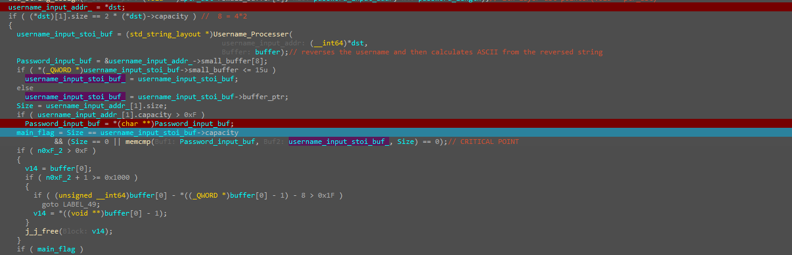
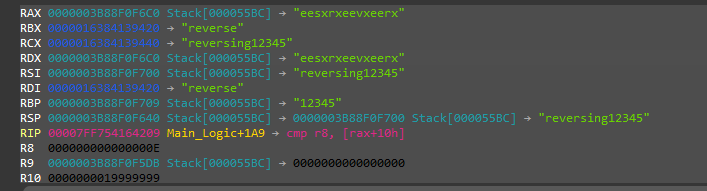
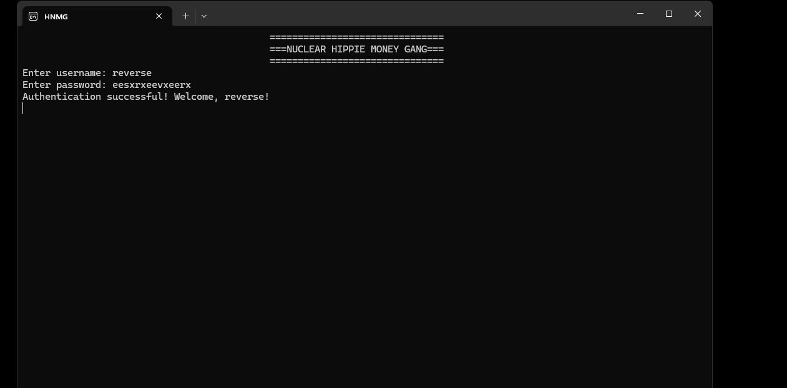

# Reversed-Username Credential Validator

> A C++ username/password check with no stored secret. The accepted password is derived at runtime from the username — reversed, then expanded to exactly twice its length — and matched with a single `memcmp`. Solved by recovering that derivation; the expected password is also observable in memory at the comparison.

## Metadata

| Field        | Value |
|--------------|-------|
| Source       | Local archive — `Language_Specific_Crackmes/C_C++` |
| Author       | unknown (banner: "NUCLEAR HIPPIE MONEY GANG") |
| Language     | C/C++ (MSVC, `std::string`) |
| Architecture | x86-64 |
| Platform     | Windows (console) |
| Difficulty   | ~3 / 6 (self-assessed) |
| Quality      | 4 / 6 (self-assessed) |
| Date solved  | 2026-09-08 |
| Time spent   | ~1h |
| Tools        | IDA Pro (Hex-Rays), x64dbg, DIE |
| Solve type   | password (algorithm recovered) |

## 1. Goal

The console prompts `Enter username:` then `Enter password:`. A matching pair prints `Authentication successful! Welcome, {}!`; anything else prints `Authentication failed! Invalid username or password.` The objective is to obtain a password that is accepted for a given username.

## 2. Triage / Recon

- **File type / compiler:** PE32+ (x86-64), MSVC, console subsystem. DIE reports it clean — no packer, no protector.
- **No stealthy entry:** IDA's entry-point list (Ctrl+E) exposes only `main`; there are no TLS callbacks, so nothing executes before `main`.
- **C++ / STL:** the program is built around `std::string`. IDA initially typed the string objects as `void***`, which rendered the logic unreadable; recovering the proper layout was the precondition for a legible decompile (see Static Analysis).
- **Banner:** prints `=== NUCLEAR HIPPIE MONEY GANG ===` (the console tab is titled `HNMG`).
- **First run:** prompts for a username, then a password, prints a verdict, and blocks on `std::cin.get()`.

## 3. Static Analysis

`main` is a thin wrapper. An initializer (`sub_...3E70`) must succeed — otherwise a `MessageBoxW` reports *"Failed to initialize the application."* — after which `Main_Logic` runs inside an SEH `try/finally` that guarantees the `std::string` destructors execute on the local buffers.

The pivotal analysis step was recovering the STL type. Hex-Rays presented the string objects as `void***`; redefining a struct that matches the MSVC `std::string` small-string-optimization layout converted the noise into readable field accesses. The correct layout is **0x20 bytes**, with the pointer and the inline buffer sharing the same 16 bytes as a union:

```c
struct std_string {          // sizeof = 0x20 (MSVC)
    union {
        char*  ptr;          // len > 15  -> heap allocation
        char   buf[16];      // len <= 15 -> inline (SSO)
    };                       // 0x00, 16 bytes
    size_t size;             // 0x10  (length)
    size_t capacity;         // 0x18  (reserved)
};
```

With that in place, `Main_Logic` reads two inputs and enforces three conditions:

1. **Username length ≥ 4** — otherwise *"Username must be at least {} characters long."* (the `{}` is `4`).
2. **Password length == 2 × username length.** With the correct layout this reads `(*dst)[1].size == 2 * (*dst)->size`: the password's length must be exactly double the username's. The length field lives at offset `0x10`; an incorrect `std::string` layout mislabels that slot as `capacity`, which is what makes the gate appear to involve capacity in the pseudocode — the value being read is the username's length either way.
3. **The password must equal `Username_Processer(username)`.**



`Username_Processer` reverses the username (`"ABC"` → `"CBA"`) and then derives, per character, an ASCII-based value (computed with `strtol` inside a loop), producing an output exactly twice the length of the username. The final decision is a single `memcmp` between the entered password and that derived buffer:

```c
main_flag =  Size == expected->size
          && (Size == 0 || memcmp(password, expected, Size) == 0);   // CRITICAL POINT
```

## 4. Dynamic Analysis

Breaking on the comparison makes the derivation concrete. For the username `reverse` (length 7), the processor produces the 14-byte expected password `eesxrxeevxeerx`, present in the registers that feed the check (RAX / RDX), with the length operand `R8 = 0xE` (14):



This is the recurring property of a compare-against-derived-secret design: the plaintext expected value is resident in memory at the moment of comparison, so it can be read directly rather than recomputed by hand.

## 5. The Core Insight

There is no embedded password. The check is entirely self-referential: the username is reversed, expanded into a string twice its length, and compared to the entered password. The credential is therefore fully determined by the username — every username of length ≥ 4 has exactly one accepted password, and that password is exposed at the `memcmp` even before the transform is fully understood.

## 6. Solution

**Accepted pair:** username `reverse` / password `eesxrxeevxeerx` (14 chars = 2 × 7).

It clears all three gates: username length `7 ≥ 4`, password length `14 = 2 × 7`, and it equals the output of `Username_Processer("reverse")`. Entering the pair authenticates:



The recovery consisted of retyping the `std::string` buffers, following `Main_Logic` to the `memcmp`, and reading the derived expected password out of memory (RAX). Equivalently, it can be reproduced by reversing the username and applying the per-character transform.

## 7. Key Takeaways

- **Recovering STL types is a force multiplier.** Hex-Rays rendered the `std::string` objects as `void***`, which hid the entire logic; a struct definition matching the real layout made the length checks and field accesses legible. This is the first thing worth doing on any MSVC C++ target.
- **`std::string` layout (MSVC, 0x20):** a 16-byte union (`char* ptr` when `len > 15`, else inline `char buf[16]`) at `0x00`, then `size` at `0x10` and `capacity` at `0x18`. Reading it with the wrong offsets mislabels the length field at `0x10` as `capacity` — which is exactly what made the `password == 2 × username` gate appear to involve capacity.
- **SSO fingerprint:** the function is littered with `... > 0xF` / `> 15` comparisons. `15` is the small-string-optimization threshold where MSVC switches from the inline `buf[16]` to a heap `ptr`; that recurring constant around string-like objects is a reliable tell for MSVC `std::string`.
- **Decompiler vs. assembly.** The "password == 2 × username length" gate had to be confirmed against the disassembly and at runtime, because the `std::string` field arithmetic renders confusingly in the decompiler until the type is corrected.
- **Compare-against-derived-secret:** the expected value is resident in memory at the `memcmp`, so reading it there is faster than reconstructing the algorithm by hand.
- **SEH `try/finally` in `main`** is only RAII scaffolding for the `std::string` locals' destructors — not part of the validation.

## 8. Artifacts

- **Accepted pair:** username `reverse` / password `eesxrxeevxeerx`
- **Constraints:** username length ≥ 4; password length == 2 × username length
- **Derivation:** password = ASCII-based per-character transform of the *reversed* username (`Username_Processer`), length `2N`
- **Comparison:** single `memcmp` against the derived buffer (`Main_Logic` critical point)
- **`std::string` layout (MSVC, 0x20):** union `ptr` / `buf[16]` at `0x00`, `size` at `0x10`, `capacity` at `0x18`
- **Banner:** `NUCLEAR HIPPIE MONEY GANG`
