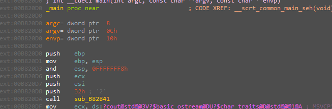
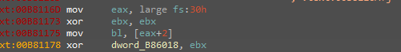
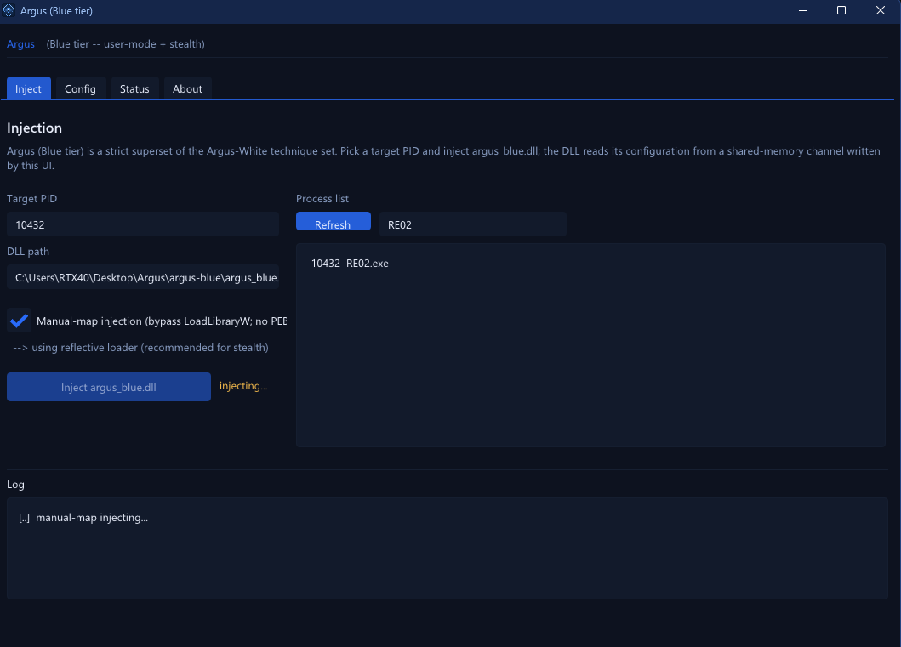
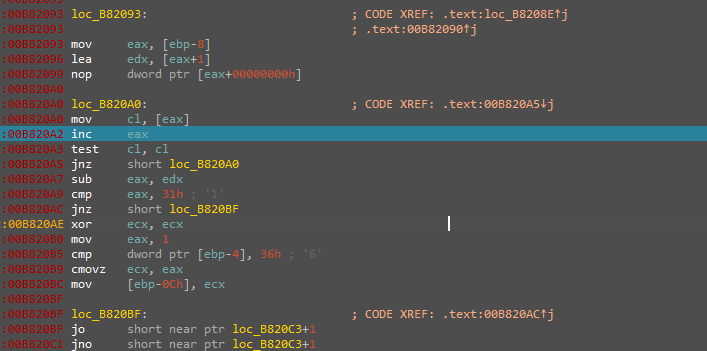

# RE02 — 32-bit Layered Constraint Validator

> A 32-bit Windows keygen-me that refuses the Hex-Rays decompiler outright. It gates a 49-byte input through 54 chained arithmetic "layers," and hides a stealth anti-debug that poisons the first layer's constant instead of branching. This writeup covers defeating the anti-analysis, neutralizing the anti-debug with Argus, and fully recovering the verification scheme. The constraint system itself was left unsolved by design (see Status).

## Metadata

| Field        | Value |
|--------------|-------|
| Source       | Local archive — `Language_Specific_Crackmes/C_C++/9` |
| Author       | unknown |
| Language     | C/C++ (MSVC, uses `std::cout`) |
| Architecture | x86 (32-bit) |
| Platform     | Windows (console) |
| Difficulty   | ~4.5 / 6 (self-assessed) |
| Quality      | 5 / 6 (self-assessed) |
| Date         | 2026-09-10 |
| Time spent   | ~3h |
| Tools        | IDA Pro (assembly only — Hex-Rays defeated), x32dbg, DIE, Argus (own anti-anti-debug) |
| Solve type   | analysis — full scheme recovered; constraint-solving deferred (low ROI) |

## 1. Goal

The binary reads a single line, validates it, and prints a success or failure verdict. The accepted input is exactly 49 characters long and must satisfy a long chain of arithmetic constraints. The objective here is to recover the verification scheme in full; producing a concrete accepted string is a separate, mechanical step discussed under Status.

## 2. Triage / Recon

- **File type / compiler:** PE32 (x86, 32-bit), MSVC, console subsystem (`std::cout` present). DIE reports it clean — no packer, no protector. The defenses are entirely in-code.
- **Decompiler denied:** Hex-Rays fails on the verification routine. The obstruction is deliberate anti-decompilation (see Section 3), so the entire analysis was performed on raw disassembly.
- **Anti-debug:** present, and unusually stealthy — it corrupts data rather than branching (Section 4).
- **Shape of the check:** a length gate, then 54 sequential "layers," each incrementing a counter at `[ebp-4]`; success requires the counter to reach `0x36` (54).

## 3. Anti-Decompilation (the ESP / opaque-predicate trick)

Two things collaborate to break Hex-Rays.

First, `_main` realigns the stack manually and keeps a non-standard frame:

```asm
push    ebp
mov     ebp, esp
and     esp, 0FFFFFFF8h      ; force 8-byte alignment, discard low ESP bits
push    ecx
push    esi
```

`and esp, 0FFFFFFF8h` clears the low bits of `ESP` so the frame no longer sits at an offset the decompiler expects. On its own this is benign alignment, but combined with the next trick it starves Hex-Rays of the stable frame it needs to reconstruct locals.



Second — and decisively — the routine uses an **opaque predicate over an overlapping instruction**:

```asm
loc_B820BF:
jo      short near ptr loc_B820C3+1
jno     short near ptr loc_B820C3+1
```

`JO` is taken when `OF=1`, `JNO` when `OF=0`; together they are an unconditional jump regardless of the overflow flag. The target is `loc_B820C3+1` — one byte *into* the next instruction — so the real execution path decodes a different instruction stream than a linear disassembly produces. This desynchronizes the disassembler and collapses the control-flow graph, which is what makes the decompiler give up and forces pure-assembly work.

## 4. Anti-Debug (data poisoning, not branching)

The standout defense. Instead of testing for a debugger and branching to a failure message, the binary folds the debug flag directly into its verification data:

```asm
mov     eax, large fs:30h    ; PEB
xor     ebx, ebx
mov     bl, [eax+2]          ; PEB->BeingDebugged  (0 or 1)
xor     dword_B86018, ebx    ; fold the flag into a "magic constant"
```



The elegance is in the target. `dword_B86018` is **dual-purpose**: it is written here (`.text:00B81178`) and later read as the expected constant of **layer 1** (`.text:00B8119C`), whose value is `0x72`. So:

- **No debugger:** `BeingDebugged = 0`, `dword_B86018` stays `0x72`, layer 1 can pass.
- **Under a debugger:** `BeingDebugged = 1`, `dword_B86018` becomes `0x73`, layer 1 can never match — and because later layers chain off the same running state, the entire validation silently dies. There is no "debugger detected" prompt; the program simply rejects every input.

This is precisely the kind of check that wastes hours if unnoticed. It was neutralized with **Argus**, my own in-development user-mode anti-anti-debugging framework. Argus reflective/manual-map injects its DLL into the target (bypassing `LoadLibraryW`, leaving no PEB LDR entry) and, among a broad set of handlers, **clears `PEB.BeingDebugged` on every apply** — so the `xor` folds a zero and `dword_B86018` retains its true `0x72`. With the flag neutralized, the layers evaluate identically under the debugger and static analysis.




*(Argus is a personal project still under test; only its role here is documented.)*

## 5. Static Analysis — the verification scheme

**Length gate.** A `strlen` loop computes the length as `end_ptr − start_ptr`, then compares it to `0x31`:

```asm
loc_B820A0:
mov     cl, [eax]
inc     eax
test    cl, cl
jnz     short loc_B820A0     ; walk to the NUL terminator
sub     eax, edx             ; eax = length (end - start)
cmp     eax, 31h             ; 0x31 = 49  -> input must be 49 bytes
jnz     short loc_B820BF
xor     ecx, ecx
mov     eax, 1
cmp     dword ptr [ebp-4], 36h   ; 0x36 = 54  -> all 54 layers must have passed
cmovz   ecx, eax
mov     [ebp-0Ch], ecx           ; success flag
```



**Layer counter.** Each of the 54 layers, when satisfied, increments `[ebp-4]`. Success requires both length `== 49` and counter `== 0x36` (54); the routine then returns `1` in `EAX`, and the caller branches to the success path on `EAX == 1`.

**The division primitive.** Layers lean on signed division, where the dividend is the 64-bit pair `EDX:EAX`:

```
idiv esi   ->   EAX = (EDX:EAX) / ESI      (quotient)
                EDX = (EDX:EAX) % ESI      (remainder)
```

The observed divisor is `13`. Crucially, the *high* half `EDX` is not always zero — later layers seed `EDX` with a running value (a previous layer's magic), which chains the layers together.

**Representative layers** (recovered from disassembly; `cN` = ASCII of the N-th character, 0-indexed):

```
Layer 1:  (c0 % 13) + c1              == 0x72     ; dword_B86018
Layer 2:  c0 + 0x13 + c1              == 0x87     ; dword_B8601C
Layer 3:  c1 * 0x13 + c2             == 0x565     ; dword_B86020
Layer 4:  ((0x72 : c3) % 13) + c4     == 0x39     ; dword_B86024
...       continues in the same form, each layer comparing against the next stored constant
```

Layer 4 shows the chaining explicitly: the dividend is `EDX:EAX = 0x72:c3` — the high dword `0x72` is layer 1's constant carried forward — so the layers are not independent; they form a rolling system.

**The constants.** All 54 per-layer targets are stored contiguously at `.data:00B86018`–`00B860EC` (54 dwords, exactly the counter target `0x36`). They are the right-hand sides of the 54 equations and are listed in full under Artifacts.

## 6. The Core Insight

The difficulty is front-loaded into the protection, not the math. Once the opaque-predicate overlap is read by hand and `PEB.BeingDebugged` is neutralized (so `dword_B86018` keeps its true `0x72`), the "verification" reduces to a deterministic, fully-recovered system: 54 chained arithmetic constraints over 49 bytes, each comparing a running value against a stored constant. That is a textbook SMT problem — the intellectual work is recovering the scheme and the chaining, which is done.

## 7. Status — why the equations were not solved

The scheme is completely characterized: the primitive (`idiv` with a 64-bit dividend), the chaining (each layer seeds `EDX` from prior state), the 54 target constants, and the two gates (length `49`, counter `54`). Feeding this to Z3 or angr to emit a concrete 49-byte string is mechanical and offered no additional learning for a practice binary, so it was **deliberately deferred as low-ROI**. Everything needed to complete it later is captured here.

For reaching and stepping the layer checks during analysis, a 49-byte probe string was used (it satisfies only the length gate, not the equations):

```
rr7#mZ2!Lx9@Rk4$Tp8^Wn6&Hy3*Cf5!Jq1%Bs0_Kd7+Xaaaa
```

This is explicitly **not** a valid key — only a length-correct input to drive execution into the layer logic.

## 8. Key Takeaways

- **`JO`/`JNO` to `target+1` is an anti-disassembly opaque predicate.** The pair is an unconditional jump; the `+1` lands mid-instruction and desynchronizes the decoder, collapsing the CFG and defeating Hex-Rays. Recognizing it early saves the time otherwise lost fighting a broken decompile.
- **Manual `and esp, 0FFFFFFF8h` + non-standard frame** removes the stable stack frame the decompiler relies on; it compounds the overlap trick.
- **Data-poisoning anti-debug.** Folding `PEB->BeingDebugged` into a constant that the algorithm consumes (here `dword_B86018`, layer 1's `0x72`) is far stealthier than a branch: there is no detectable check to NOP, only silent, total failure. Neutralizing the flag at the PEB (Argus) is the clean fix.
- **`idiv` uses `EDX:EAX` as a 64-bit dividend.** The high dword matters; ignoring it misreads every layer. Here it is the mechanism that chains the layers.
- **Analyst judgment on ROI.** Recovering the scheme is the skill worth having; grinding a solver across 54 layers for a practice target is not. Knowing when to stop is part of the craft.

## 9. Artifacts

- **Length gate:** `0x31` (49 bytes). **Layer counter target:** `0x36` (54).
- **Division primitive:** `idiv esi` → `EAX = (EDX:EAX)/ESI`, `EDX = (EDX:EAX)%ESI`; observed divisor `13`.
- **Anti-decompilation:** `jo/jno loc_B820C3+1` overlapping-instruction opaque predicate; `and esp, 0FFFFFFF8h`.
- **Anti-debug:** `mov eax, fs:30h; mov bl,[eax+2]; xor dword_B86018, ebx` — poisons layer-1 constant `0x72`. Neutralized by clearing `PEB.BeingDebugged` (Argus).
- **Length probe (not a key):** `rr7#mZ2!Lx9@Rk4$Tp8^Wn6&Hy3*Cf5!Jq1%Bs0_Kd7+X` + `aaaa`
- **Recovered layers 1–4:**
  ```
  (c0 % 13) + c1           == 0x72
  c0 + 0x13 + c1           == 0x87
  c1 * 0x13 + c2          == 0x565
  ((0x72 : c3) % 13) + c4  == 0x39
  ```
- **54 per-layer constants** (`.data:00B86018`–`00B860EC`, in order):
  ```
  0x72  0x87  0x565 0x39  0xEE  0x8D7 0x82  0xA5  0x83F 0x6F
  0xBF  0x95E 0x32  0xB8  0xAB0 0x74  0x7D  0x50B 0x42  0xF9
  0xB9D 0x7D  0xE5  0xB6C 0x7B  0xB6  0x5CF 0x86  0xC2  0x58F
  0x5BB 0x18CE 0xA97E 0x6B00 0xDA17 0x892B4 0x12F064 0x24859 0x24A29 0x3E7
  0xA50C7 0x8BEF 0x36D 0x133 0x2CF 0x1A1 0x38 0x33 0x66 0x35
  0x32  0x31  0x34  0x34
  ```
- **Binary:** `Binary/RE02.exe`
