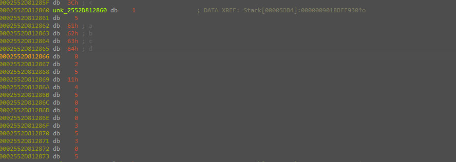
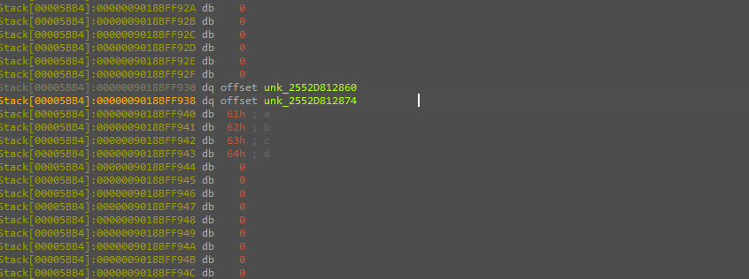
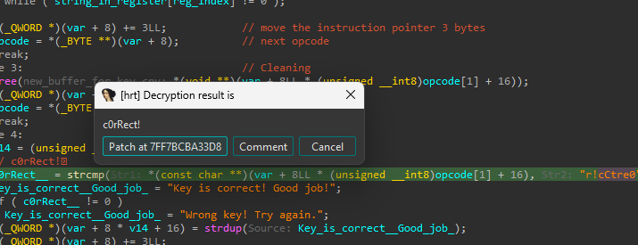
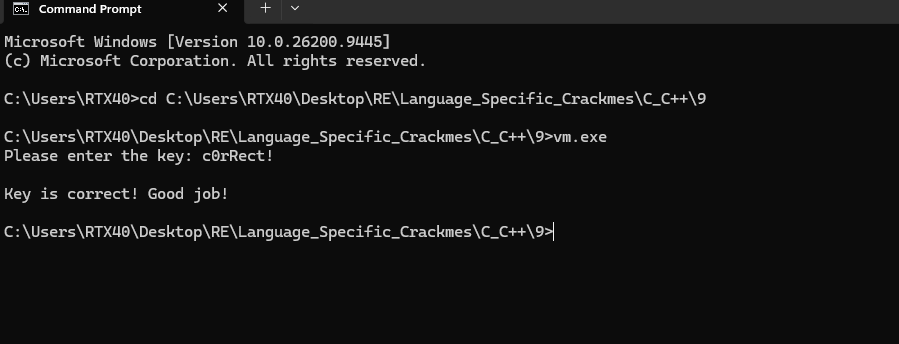

# Bytecode-VM Key Validator

> The key check runs inside a small custom bytecode virtual machine. `main` hand-assembles a program around the entered key, and a switch-dispatch interpreter loads that key, XORs it byte-wise with `0x11`, and `strcmp`s the result against the hardcoded string `r!cCtre0`. Because XOR is self-inverting, the accepted key is `r!cCtre0 ^ 0x11` = `c0rRect!`.

## Metadata

| Field        | Value                                                  |
|--------------|--------------------------------------------------------|
| Source       | Local archive — `Language_Specific_Crackmes/C_C++/9`   |
| Author       | unknown                                                |
| Language     | C/C++ (MSVC, `std::string` / `std::cout` / `std::cin`) |
| Architecture | x86-64                                                 |
| Platform     | Windows (console)                                      |
| Difficulty   | ~3.5 / 6 (self-assessed)                               |
| Quality      | 4.5 / 6 (self-assessed)                                |
| Date solved  | 2026-09-11                                             |
| Time spent   | ~0.5–1h                                                |
| Tools        | IDA Pro (Hex-Rays), hrtng plugin, x64dbg               |
| Solve type   | password (recovered)                                   |

## 1. Goal

The program prints `Please enter the key:`, reads one line, validates it through a bytecode VM, and prints `Key is correct! Good job!` or `Wrong key! Try again.` The objective is the accepted key.

## 2. Triage / Recon

- **File type / compiler:** PE32+ (x86-64), MSVC, console subsystem; standard C++ runtime (`std::string`, `std::cin`/`std::cout`). Not packed.
- **Shape of the check:** the validation is not inline. `main` reads the key, builds a byte buffer, and hands it to a dispatcher (`Main_Logic`) that walks a stream of opcodes — a hallmark switch-dispatch virtual machine. The real logic therefore lives in the *bytecode*, not in native control flow.

## 3. Static Analysis

### 3.1 `main` assembles a bytecode program around the key

After reading the key into a `std::string`, `main` allocates `key_length + 16` bytes and lays out a small program:

```c
new_buffer = malloc(key_length + 16);
*(_WORD*)new_buffer = 0x0501;                       // header bytes: 01 05  ->  LOADSTR reg5
memcpy(new_buffer + 2, key, key_length + 1);        // inline payload = the user's key (+ NUL)
*(_QWORD*)&buf[key_length + 3]  = 0x504110502;      // appended opcodes (tail)
*(_DWORD*)&buf[key_length + 11] = 0x30503;          // appended opcodes (tail)
buf[key_length + 15]            = 0x05;             // HALT
Main_Logic(...);                                    // run the VM
```

The "magic" trailer is not data — it is the rest of the program. Decoded little-endian, the whole buffer is:

```
01 05 <key bytes> 00   LOADSTR reg5, "<key>"
02 05 11               XOR     reg5, 0x11
04 05 00               CMP     reg5 -> reg0
00 00                  PRINT   reg0
03 05                  FREE    reg5
03 00                  FREE    reg0
05                     HALT
```

### 3.2 The VM dispatcher

`Main_Logic` is a classic fetch/decode/execute loop: a running flag at `var[0]`, an instruction pointer at `var+8`, a register file at `var+16` (each register `8*n+16`), and bytecode bounds at `var+80` / `var+88`. Each iteration switches on the current opcode:

| Opcode | Mnemonic | Encoding | Len | Effect |
|--------|----------|----------|-----|--------|
| `0x00` | `PRINT reg[b1]` | `00 b1` | 2 | writes the string held in register `b1` to `std::cout` |
| `0x01` | `LOADSTR reg[b1], "..."` | `01 b1 <asciiz>` | `strlen+3` | `malloc`+copy the inline NUL-terminated string into register `b1` |
| `0x02` | `XOR reg[b1], b2` | `02 b1 b2` | 3 | XORs every byte of the string in register `b1` with the immediate `b2` |
| `0x03` | `FREE reg[b1]` | `03 b1` | 2 | frees register `b1` |
| `0x04` | `CMP reg[b1] -> reg[b2]` | `04 b1 b2` | 3 | `strcmp(reg[b1], "r!cCtre0")`; stores the verdict string into register `b2` |
| `0x05` | `HALT` | `05` | 1 | clears the running flag; the loop exits |

The decisive opcodes are `0x02` (the immediate `0x11` is the XOR key) and `0x04` (the comparison target is the hardcoded `"r!cCtre0"`).

### 3.3 The dumped bytecode

Dumping the embedded bytecode confirms the encoding. The `LOADSTR` payload in the static copy is a placeholder `"abcd"` (`61 62 63 64`), and the XOR immediate `11h` is plainly visible; at runtime `main` substitutes the entered key for that payload.





## 4. The Core Insight

Stripped to its essence, the VM performs exactly one meaningful transformation and one test:

```
reg5 = key
reg5 = reg5 XOR 0x11        (byte-wise)
pass  <=>  strcmp(reg5, "r!cCtre0") == 0
```

XOR with a constant is its own inverse, so the condition `key ^ 0x11 == "r!cCtre0"` inverts directly to `key == "r!cCtre0" ^ 0x11`. No search or solver is required.

## 5. Solution

Applying `^ 0x11` to `r!cCtre0`:

```
r  0x72 ^ 0x11 = 0x63  c
!  0x21 ^ 0x11 = 0x30  0
c  0x63 ^ 0x11 = 0x72  r
C  0x43 ^ 0x11 = 0x52  R
t  0x74 ^ 0x11 = 0x65  e
r  0x72 ^ 0x11 = 0x63  c
e  0x65 ^ 0x11 = 0x74  t
0  0x30 ^ 0x11 = 0x21  !
```

**Key:** `c0rRect!`

The same XOR inversion was performed with the hrtng Hex-Rays plugin (Kaspersky Lab), whose decryption helper resolves `r!cCtre0 ^ 0x11` to `c0rRect!` directly:



Entering it authenticates:



## 6. Key Takeaways

- **Switch-dispatch VM recognition.** A dispatcher that reads a running flag, an instruction pointer, and a register array, then `switch`es on a byte, is a bytecode interpreter. Once that shape is recognized, the effort shifts from native code to decoding the opcode grammar.
- **Self-modifying layout in `main`.** The `0x0501` header plus the "magic" trailer were not data — they were the opcodes wrapping the key. Treating the whole allocated buffer as a program, not a struct, was the unlock.
- **Recovering the opcode table first.** Mapping each opcode's operands and instruction-pointer advance turns an opaque byte stream into a readable listing; from there the program (`LOADSTR → XOR → CMP → PRINT`) is trivial to read.
- **XOR is self-inverting.** A comparison of `input ^ k` against a constant collapses immediately to `constant ^ k`; the plugin merely automated the byte math.

## 7. Artifacts

- **Key:** `c0rRect!`
- **XOR immediate:** `0x11`  ·  **Comparison target:** `"r!cCtre0"`
- **Opcode set:** `00` PRINT, `01` LOADSTR, `02` XOR, `03` FREE, `04` CMP (vs `"r!cCtre0"`), `05` HALT
- **Program (decoded):**
  ```
  LOADSTR reg5, "<key>"
  XOR     reg5, 0x11
  CMP     reg5 -> reg0
  PRINT   reg0
  FREE    reg5
  FREE    reg0
  HALT
  ```
- **VM context layout:** `var[0]` running flag · `var+8` IP · `var+16` register file (`8*n+16`) · `var+80`/`var+88` bytecode bounds
- **Binary:** `Binary/vm.exe`
