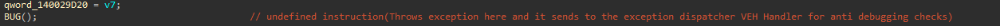
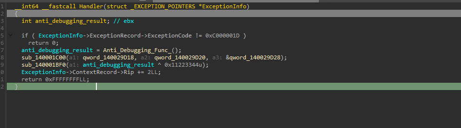
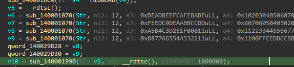
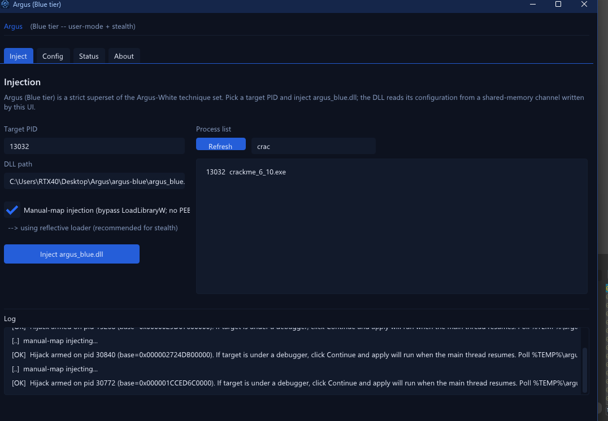
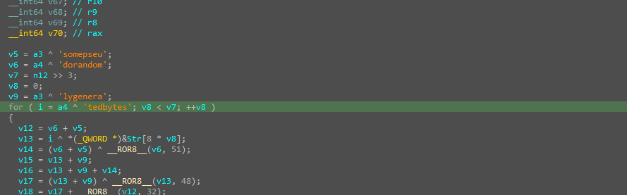
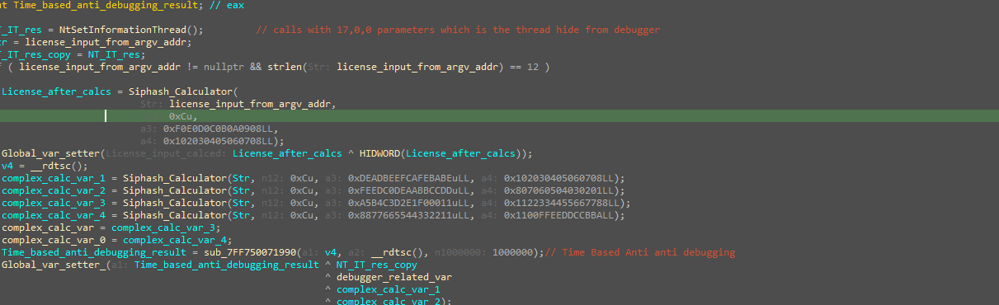
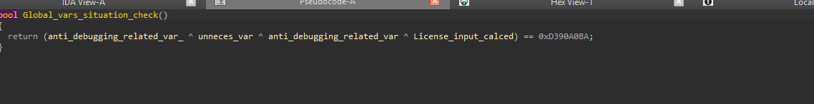
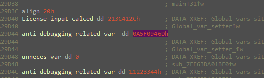
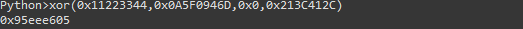

# VEH-Guarded SipHash License Validator

> A license check that hides its anti-debug logic inside a Vectored Exception Handler, runs the input through several keyed SipHash instances, and gates success on an XOR of four globals equaling `0xD390A0BA`. Because SipHash is a one-way keyed PRF, no keygen is possible; the clean solve is a patch — compute the XOR value for a chosen 12-char input and retarget the comparison constant.

## Metadata

| Field        | Value |
|--------------|-------|
| Source       | Local archive — `Language_Specific_Crackmes/C_C++/10` |
| Author       | unknown |
| Language     | C/C++ (MSVC) |
| Architecture | x86-64 |
| Platform     | Windows (console) |
| Difficulty   | ~3 / 6 (self-assessed) |
| Quality      | 5.5 / 6 (self-assessed) |
| Date solved  | 2026-09-12 |
| Time spent   | ~2–3h |
| Tools        | IDA Pro (Hex-Rays), x64dbg, Argus (own anti-anti-debug) |
| Solve type   | patch (keygen infeasible — one-way SipHash) |

## 1. Goal

The program validates a 12-character license and prints `[+] VALID` or `[-] FAIL`. It accepts the license two ways that converge on the same check:

- **Command line:** `crackme_.exe <license>` (the argument is read from `argv[1]`).
- **Interactive:** when launched with `argc <= 1`, it prompts and reads the license via `fgets`.

## 2. Triage / Recon

- **File type:** PE32+ (x86-64), MSVC, console. Not packed — every defense is in-code.
- **Two entry paths** as above; both feed the same validation routine.
- **Heavy anti-analysis** layered around the check: exception-driven control flow, thread-hiding, timing checks, and a background cleaning thread (Section 3).
- **Keyed hashing** at the core (Section 4), identified as SipHash.

## 3. Anti-Analysis

### 3.1 Exception-driven control flow (`ud2` + VEH)

The binary deliberately executes an undefined instruction (`ud2`, shown as `BUG()`), raising `STATUS_ILLEGAL_INSTRUCTION`:



A registered Vectored Exception Handler catches exactly that code and does the real work — running the anti-debug routine, folding its result into globals, and skipping past the faulting instruction:

```c
__int64 __fastcall Handler(_EXCEPTION_POINTERS *ExceptionInfo)
{
    if (ExceptionInfo->ExceptionRecord->ExceptionCode != 0xC000001D)  // STATUS_ILLEGAL_INSTRUCTION
        return 0;                                                     // EXCEPTION_CONTINUE_SEARCH
    anti_debugging_result = Anti_Debugging_Func_();
    sub_140001C00(qword_140029D18, qword_140029D20, &qword_140029D28);
    sub_140001BF0(anti_debugging_result ^ 0x11223344);               // mix into a global
    ExceptionInfo->ContextRecord->Rip += 2;                          // step over the 2-byte ud2
    return -1;                                                        // EXCEPTION_CONTINUE_EXECUTION
}
```



Relocating logic into an exception handler both obscures control flow (the decompiler shows a dead-end `BUG()`) and trips naive debuggers that consume or mishandle the exception.

### 3.2 Thread hiding, timing, and cleaning

- **`NtSetInformationThread(handle, 0x11, 0, 0)`** — `ThreadHideFromDebugger` (class 17).
- **`rdtsc` timing envelope** — a timestamp is taken before and after the hashing block and compared with a `~1,000,000`-cycle budget; single-stepping or breakpoints blow the budget and are treated as a debugger.



- **Cleaning thread** — a background `Cleaning_Func` runs off a stored thread address (`ThrdAddr[2]`).
- Additional standard probes (e.g., `IsDebuggerPresent`, remote-thread checks) feed the same global state.

Every one of these results is XOR-mixed into the globals that the final gate consumes, so tampering or detection does not branch to an obvious failure — it silently poisons the arithmetic.

### 3.3 Neutralizing it with Argus

All of the above was neutralized with **Argus** (my own user-mode anti-anti-debug framework), manual-map injected into the target so the anti-debug routines observe a clean process and the globals retain their untampered values:



## 4. Static Analysis — the validation

### 4.1 SipHash identification

The hashing routine is unmistakably **SipHash**: its initialization constants are the ASCII strings `somepseu`, `dorandom`, `lygenera`, `tedbytes` — i.e. `"somepseudorandomlygeneratedbytes"`, SipHash's four 64-bit init words — followed by the characteristic add/rotate (`ROTL`) round structure over a 128-bit key.



### 4.2 The license path

With a 12-byte license, the input is run through several keyed SipHash instances. The first produces the license value; the remainder are mixed with the anti-debug and timing results into the gate globals:

```c
if (license != nullptr && strlen(license) == 12)
{
    License_after_calcs = Siphash(license, 12, 0x0F0E0D0C0B0A0908, 0x0102030405060708);
    License_input_calced = (u32)License_after_calcs ^ HIDWORD(License_after_calcs);   // fold 64 -> 32

    t0 = __rdtsc();
    c1 = Siphash(license, 12, 0xDEADBEEFCAFEBABE, 0x0102030405060708);
    c2 = Siphash(license, 12, 0xFEEDC0DEAABBCCDD, 0x0807060504030201);
    c3 = Siphash(license, 12, 0xA584C3D2E1F00011, 0x1122334455667788);
    c4 = Siphash(license, 12, 0x8877665544332211, 0x1100FFEEDDCCBBAA);
    time_result = timing_check(t0, __rdtsc(), 1000000);
    anti_debug_global = time_result ^ NT_IT_res ^ debugger_related_var ^ c1 ^ c2;   // entangle input with anti-debug
}
```



### 4.3 The final gate

Verdict is a single XOR of four globals against a constant:

```c
bool Global_vars_situation_check()
{
    return (anti_debugging_related_var_ ^ unneces_var ^ anti_debugging_related_var ^ License_input_calced) == 0xD390A0BA;
}
```



`main` then prints `[+] VALID` when this returns true, `[-] FAIL` otherwise.

## 5. The Core Insight

The gate depends on `License_input_calced`, which is a **folded SipHash of the license**. SipHash is a one-way keyed PRF — there is no way to invert `0xD390A0BA` back into a 12-character license, so a keygen is infeasible by design. What *is* trivial, once the anti-debug is neutralized so the globals are stable, is to run any chosen input, read the four globals, and make the equation true by retargeting the comparison constant. The protection defends the algorithm; it does not defend the single `cmp` that consumes it.

## 6. Solution (patch)

With Argus keeping the process clean, the input `crackedouttt` (12 chars) was entered, and the four globals were read from memory:

```
License_input_calced        = 0x213C412C
anti_debugging_related_var_ = 0xA5F0946D
unneces_var                 = 0x00000000
anti_debugging_related_var  = 0x11223344
```



Their XOR is the value the gate actually produces for this input:

```
0x11223344 ^ 0xA5F0946D ^ 0x00000000 ^ 0x213C412C = 0x95EEE605
```



Patching the gate's comparison immediate `0xD390A0BA` → `0x95EEE605` (little-endian `BA A0 90 D3` → `05 E6 EE 95`) makes `Global_vars_situation_check()` return true for `crackedouttt`:

![License: crackedouttt -> [+] VALID](10_success.png)

**Accepted (post-patch):** `crackedouttt` → `[+] VALID`.

## 7. Key Takeaways

- **VEH as a logic vault.** A `ud2`/`int3` whose exception is handled by a registered VEH moves real behavior out of the linear code path: the decompiler shows a dead end, and debuggers that swallow the exception diverge. Reading `RIP += 2` and `EXCEPTION_CONTINUE_EXECUTION` in the handler is the tell.
- **Silent anti-debug via data poisoning.** Results are XOR-mixed into the values the check consumes rather than branching, so detection manifests as a wrong hash, not a visible jump. Neutralizing the sources (Argus) keeps the globals clean.
- **SipHash fingerprint.** The init words `somepseudorandomlygeneratedbytes` plus 128-bit-keyed add/rotate rounds identify SipHash on sight.
- **One-way hash ⇒ patch, not keygen.** When acceptance depends on a preimage of a cryptographic hash, inverting it is infeasible; the pragmatic solve is to compute the check's output for a chosen input and retarget the comparison constant.

## 8. Artifacts

- **Accepted (post-patch) input:** `crackedouttt` (12 chars)
- **Patch:** `Global_vars_situation_check` compare immediate `0xD390A0BA` → `0x95EEE605`
- **Final gate:** `(anti_debugging_related_var_ ^ unneces_var ^ anti_debugging_related_var ^ License_input_calced) == 0xD390A0BA`
- **Observed globals (clean run, `crackedouttt`):** `0x213C412C`, `0xA5F0946D`, `0x00000000`, `0x11223344` → XOR `0x95EEE605`
- **Hash:** SipHash (init words `somepseudorandomlygeneratedbytes`); license key `k0=0x0F0E0D0C0B0A0908`, `k1=0x0102030405060708`; result folded `low32 ^ high32`
- **VEH:** handles `0xC000001D` (illegal instruction from `ud2`), `RIP += 2`, `EXCEPTION_CONTINUE_EXECUTION`
- **Anti-debug set:** `NtSetInformationThread` (ThreadHideFromDebugger, class 17), `rdtsc` timing (~1e6 cycles), cleaning thread, `IsDebuggerPresent`/remote-thread probes — all neutralized with Argus
- **Binary:** `Binary/crackme_.exe`
