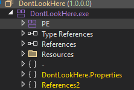
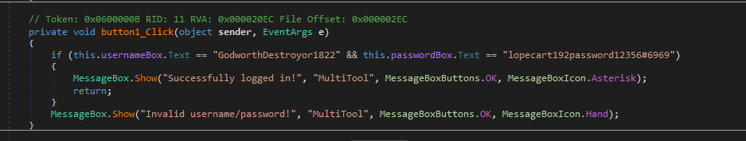
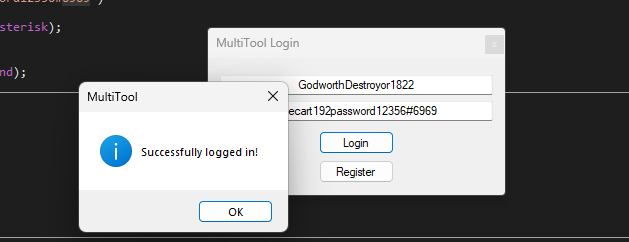

# MultiTool — Plaintext Credential Check (.NET Managed)

> A WinForms login that compares the username and password against two hardcoded string literals. As an unobfuscated managed .NET assembly, it decompiles to near-original C#, so the credentials are read straight out of the click handler — nothing to reverse, only to read.

## Metadata

| Field        | Value |
|--------------|-------|
| Source       | Local archive — `Language_Specific_Crackmes/DOT_NET/DOT_NET_Managed/1` |
| Author       | unknown (assembly: `DontLookHere`, product: `MultiTool`) |
| Language     | C# / .NET (managed, WinForms) |
| Architecture | MSIL (AnyCPU) |
| Platform     | Windows (.NET) |
| Difficulty   | 1.0 / 6 (self-assessed) |
| Quality      | 2 / 6 (self-assessed) |
| Date solved  | 2026-09-13 |
| Time spent   | ~5 min |
| Tools        | dnSpy, DIE |
| Solve type   | password (plaintext, read from decompilation) |

> First target on the .NET Managed track — kept as a baseline reference for how managed RE differs from native.

## 1. Goal

`multiTool.exe` presents a "MultiTool Login" window with username/password fields and Login/Register buttons. Correct credentials produce `Successfully logged in!`; anything else produces `Invalid username/password!`. The objective is the accepted username/password pair.

## 2. Triage / Recon

- **File type:** .NET managed assembly (`multiTool.exe`, ~9.7 KB), WinForms UI. DIE identifies it as .NET.
- **Internal identity:** the assembly's display name is `DontLookHere` (1.0.0.0) — a bit of misdirection — while the product string is `MultiTool`.
- **Obfuscation:** none. Type and member names are intact, so a decompiler reconstructs readable C#.



The decisive difference from native targets: managed .NET ships full metadata (names, types, method signatures) and compiles to MSIL, not machine code. Tools like dnSpy/ILSpy/dotPeek turn that MSIL back into near-source C#. Absent an obfuscator, "reversing" collapses into "reading."

## 3. Static Analysis

Opening the assembly in dnSpy and navigating to the Login button's handler shows the entire check in plaintext:

```csharp
// Token: 0x0600000B RID: 11
private void button1_Click(object sender, EventArgs e)
{
    if (this.usernameBox.Text == "GodworthDestroyor1822" &&
        this.passwordBox.Text == "lopecart192password12356#6969")
    {
        MessageBox.Show("Successfully logged in!", "MultiTool", MessageBoxButtons.OK, MessageBoxIcon.Asterisk);
        return;
    }
    MessageBox.Show("Invalid username/password!", "MultiTool", MessageBoxButtons.OK, MessageBoxIcon.Hand);
}
```



The credentials are string literals compared directly with `==`. There is no hashing, encoding, or transformation.

## 4. The Core Insight

An unobfuscated managed assembly exposes its logic as literals in decompiled C#. The "check" is a plain string equality, so the answer is present verbatim in the source — reading the handler *is* the solve.

## 5. Solution

- **Username:** `GodworthDestroyor1822`
- **Password:** `lopecart192password12356#6969`

Entering the pair yields `Successfully logged in!`:



## 6. Key Takeaways

- **Managed ≠ native.** .NET (and Java) compile to a metadata-rich intermediate language that decompiles back to near-source. The first move on any managed target is to open it in dnSpy/ILSpy/dotPeek and read.
- **Check for obfuscation first.** The one thing that changes managed difficulty is a protector (ConfuserEx, Dotfuscator, .NET Reactor). Here there is none, so member names and string literals are intact and the check is trivially visible.
- **String literals are the fast path.** On managed binaries, searching the decompiled strings/handlers for the success and failure messages leads directly to the comparison that gates them.
- **Cosmetic misdirection.** The assembly is named `DontLookHere` — a label, not a defense. Naming has no bearing on what the decompiler reveals.

## 7. Artifacts

- **Credentials:** `GodworthDestroyor1822` / `lopecart192password12356#6969`
- **Handler:** `button1_Click` (Token `0x0600000B`) — direct `==` comparison, `MessageBox` on success/failure
- **Assembly:** internal name `DontLookHere` (1.0.0.0), product `MultiTool`, no obfuscation
- **Binary:** `Binary/multiTool.exe`
