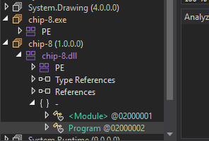
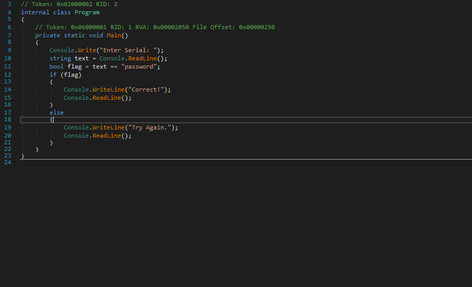
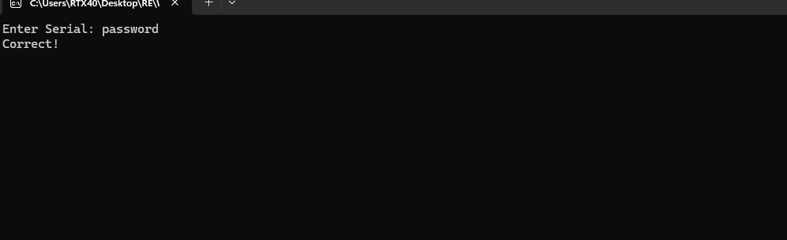

# chip-8 — Plaintext Serial in the Managed DLL (.NET Managed)

> A console "serial" check where the `.exe` is only the .NET apphost launcher and the real code lives in the same-named managed `.dll`. `Program.Main` compares the input against the literal `"password"`, visible directly in the decompiled DLL.

## Metadata

| Field        | Value |
|--------------|-------|
| Source       | Local archive — `Language_Specific_Crackmes/DOT_NET/DOT_NET_Managed` (chip-8) |
| Author       | unknown |
| Language     | C# / .NET (managed, .NET Core/5+ console) |
| Architecture | MSIL (managed DLL) + native apphost `.exe` |
| Platform     | Windows (.NET) |
| Difficulty   | 1.0 / 6 (self-assessed) |
| Quality      | 2 / 6 (self-assessed) |
| Date solved  | 2026-09-14 |
| Time spent   | ~5 min |
| Tools        | dnSpy, DIE |
| Solve type   | password (plaintext, read from decompilation) |

## 1. Goal

Running `chip-8.exe` prints `Enter Serial:` and reads a line. The correct serial prints `Correct!`; anything else prints `Try Again.` The objective is the accepted serial.

## 2. Triage / Recon

- **Distribution:** `chip-8.exe`, `chip-8.dll`, and `chip-8.runtimeconfig.json`. The `runtimeconfig.json` is the giveaway that this is a modern **.NET (Core/5+)** application.
- **Where the code lives:** in this model the `.exe` is a native **apphost** — a thin bootstrapper that locates the runtime and hands off to the managed assembly of the same name. The actual IL is in **`chip-8.dll`**, not the `.exe`. Loading the DLL in dnSpy shows the real program (`Program.Main`), while the `.exe` holds no interesting logic.
- **Obfuscation:** none — type/member names and string literals are intact.



## 3. Static Analysis

`chip-8.dll` → `Program.Main` is the entire check:

```csharp
// Token: 0x06000001 RID: 1
private static void Main()
{
    Console.Write("Enter Serial: ");
    string text = Console.ReadLine();
    bool flag = text == "password";
    if (flag)
    {
        Console.WriteLine("Correct!");
        Console.ReadLine();
    }
    else
    {
        Console.WriteLine("Try Again.");
        Console.ReadLine();
    }
}
```



The serial is compared, verbatim and unencrypted, with `text == "password"`.

## 4. The Core Insight

Two trivial facts combine: (1) in .NET Core/5+ the managed code sits in the `.dll` behind an apphost `.exe`, so the DLL is where analysis happens; and (2) with no obfuscation, the accepted serial is a plaintext string literal in `Main`. Reading the handler is the solve.

## 5. Solution

- **Serial:** `password`

Entering it prints `Correct!`:



## 6. Key Takeaways

- **In .NET Core/5+, open the DLL, not the EXE.** The `.exe` is usually a native apphost launcher; the IL lives in the same-named `.dll`. `runtimeconfig.json` / `.deps.json` next to the binary are the tells. On a framework-dependent app, `dotnet chip-8.dll` runs the same thing the `.exe` bootstraps.
- **Unobfuscated managed = readable.** With names and literals intact, the decompiler reconstructs near-source C#.
- **String-literal fast path.** Locating the success/failure messages (`Correct!` / `Try Again.`) leads straight to the comparison that gates them.
- **Theme is cosmetic.** The "chip-8" naming is flavor, not an emulator's worth of logic — the check is a single string equality.

## 7. Artifacts

- **Serial:** `password`
- **Entry point:** `chip-8.dll` → `Program.Main` (Token `0x06000001`) — `text == "password"`, `Console.WriteLine` on each branch
- **Distribution:** apphost `chip-8.exe` + managed `chip-8.dll` + `chip-8.runtimeconfig.json`; no obfuscation
- **Binary:** `Binary/chip-8.exe` (+ `chip-8.dll`)
