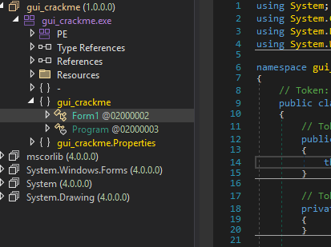
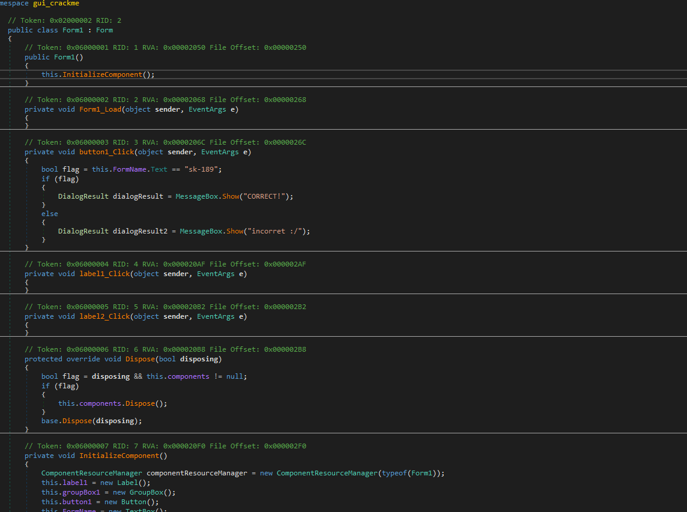
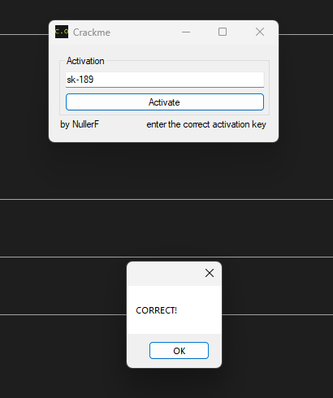

# gui-crackme — Plaintext Activation Key (.NET Managed)

> A WinForms "activation" dialog (by NullerF) whose Activate button compares the key field against the literal `"sk-189"`. Unobfuscated .NET Framework, so the key is read directly from the decompiled `button1_Click`.

## Metadata

| Field        | Value |
|--------------|-------|
| Source       | Local archive — `Language_Specific_Crackmes/DOT_NET/DOT_NET_Managed` (gui-crackme) |
| Author       | NullerF (credited in the UI) |
| Language     | C# / .NET Framework 4.x (managed, WinForms) |
| Architecture | MSIL (AnyCPU) |
| Platform     | Windows (.NET Framework) |
| Difficulty   | 1.0 / 6 (self-assessed) |
| Quality      | 2 / 6 (self-assessed) |
| Date solved  | 2026-09-15 |
| Time spent   | ~5 min |
| Tools        | dnSpy, DIE |
| Solve type   | password (plaintext, read from decompilation) |

## 1. Goal

The app shows a "Crackme" window with an Activation text field and an Activate button; the hint reads *"enter the correct activation key."* The correct key prints `CORRECT!`, anything else `incorret :/`. The objective is the accepted key.

## 2. Triage / Recon

- **File type:** .NET managed assembly `gui_crackme.exe` (1.0.0.0), WinForms, classes `Form1` and `Program`. References `mscorlib` / `System.Windows.Forms` / `System` / `System.Drawing` at `4.0.0.0`.
- **Runtime flavor:** classic **.NET Framework 4.x** — here the `.exe` *is* the managed assembly (no `runtimeconfig.json`, no apphost/DLL split). A quick way to tell it apart from a .NET Core app: Framework references the `4.0.0.0` BCL assemblies and ships as a single managed `.exe`.
- **Obfuscation:** none — names and literals intact.



## 3. Static Analysis

`Form1` → the Activate button handler is the whole check:

```csharp
// Token: 0x06000003 RID: 3
private void button1_Click(object sender, EventArgs e)
{
    bool flag = this.FormName.Text == "sk-189";
    if (flag)
        MessageBox.Show("CORRECT!");
    else
        MessageBox.Show("incorret :/");
}
```



The key control is named `FormName` (a slightly misleading name for a text box), but the data flow is unambiguous: its `.Text` is compared, verbatim, with `"sk-189"`.

## 4. The Core Insight

Unobfuscated managed code exposes the check as a plaintext literal. Following the button handler's data flow — regardless of the control's misleading name — yields the key directly.

## 5. Solution

- **Activation key:** `sk-189`

Entering it prints `CORRECT!`:



## 6. Key Takeaways

- **Framework vs Core, at a glance.** A single managed `.exe` referencing `4.0.0.0` BCL assemblies is .NET Framework (the `.exe` holds the IL). A native `.exe` beside a same-named `.dll` + `runtimeconfig.json` is .NET Core/5+ (the DLL holds the IL). Knowing which decides where to look.
- **Follow data flow, not control names.** The text box is called `FormName`, not `keyBox` — member/control names can be intentionally misleading; the `.Text == "..."` comparison is the truth.
- **String-literal fast path.** The verdict strings (`CORRECT!` / `incorret :/`) lead straight to the gating comparison.

## 7. Artifacts

- **Activation key:** `sk-189`
- **Handler:** `Form1.button1_Click` (Token `0x06000003`) — `this.FormName.Text == "sk-189"`, `MessageBox` per branch
- **Assembly:** `gui_crackme.exe`, .NET Framework 4.x WinForms, author NullerF, no obfuscation
- **Binary:** `Binary/gui-crackme.exe`
