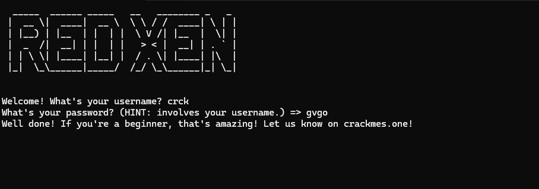

# Fun CrackMe — Caesar +4 of the Username (.NET Managed)

> An unobfuscated .NET console crackme that derives the password from the username with a deliberately tangled chain of character-literal additions and subtractions. Fold the constants and the whole thing collapses to a single `+4` ASCII shift, so the password is just the username shifted forward by four — a one-line keygen.

## Metadata

| Field        | Value |
|--------------|-------|
| Source       | Local archive — Fun CrackMe (`Fun_CrackMe`, crackmes.one) |
| Author       | REDXEN (watermark) |
| Language     | C# / .NET (managed, console) |
| Architecture | MSIL |
| Platform     | Windows (.NET) |
| Difficulty   | 1.5 / 6 (self-assessed) |
| Quality      | 2.0 / 6 (self-assessed) |
| Date solved  | 2026-09-16 |
| Time spent   | ~10 min |
| Tools        | dnSpy |
| Solve type   | keygen (password = username shifted +4) |

## 1. Goal

The program asks for a username, then a password, with the hint *"involves your username."* A matching password prints `Well done!`. The objective is the rule that maps the username to the accepted password.

## 2. Triage / Recon

- **File type:** .NET managed console app (`Fun_CrackMe`), unobfuscated — dnSpy reconstructs clean C#.
- **Author watermark:** an ASCII "REDXEN" banner is printed at startup; the success line points to crackmes.one.
- **Where the logic is:** `Program.AskForPassword` builds the expected password from the username and compares.

## 3. Static Analysis

The comparison is straightforward; the interesting part is how the expected password is built:

```csharp
for (int i = 0; i < Program.userName.Length; i++)
{
    Program.actualPassword +=
        ((char)((int)(Program.userName[i] + '\u0003' + '\u0001' - '\u0002' + '\u0001' + '\u0001' + '\u0017') + -23)).ToString();
}
if (Program.password == Program.actualPassword) { /* Well done! */ }
```

The pile of character literals is just misdirection. Folding the constants:

```
userName[i] + 3 + 1 - 2 + 1 + 1 + 23 - 23
= userName[i] + (3 + 1 - 2 + 1 + 1 + 23) - 23
= userName[i] + 27 - 23
= userName[i] + 4
```

So each expected-password character is the corresponding username character plus 4.

## 4. The Core Insight

`actualPassword[i] = (char)(userName[i] + 4)` — a Caesar shift of +4 over the username. Nothing is hashed or hidden; the tangled additions net to a single constant.

## 5. Solution (keygen)

**Rule:** password = username with every character shifted `+4` in ASCII.

Worked example for username `crck`:

| char | ASCII | +4 | result |
|------|-------|----|--------|
| c | 99  | 103 | g |
| r | 114 | 118 | v |
| c | 99  | 103 | g |
| k | 107 | 111 | o |

- **Username:** `crck`
- **Password:** `gvgo`



Keygen, one line:

```python
password = "".join(chr(ord(c) + 4) for c in username)
```

## 6. Key Takeaways

- **Fold constant arithmetic before reacting to it.** A long chain of `+`/`-` character literals is a common way to disguise a trivial offset; summing them here turns `+3+1-2+1+1+23-23` into a plain `+4`.
- **Unobfuscated managed = read the C#.** With names and literals intact, the whole routine is visible in the decompiler; no dynamic work needed.
- **Take the hint literally.** *"Involves your username"* pointed straight at a per-character transform of the username, which is exactly what the loop does.

## 7. Artifacts

- **Rule:** `password[i] = username[i] + 4` (ASCII)
- **Worked pair:** `crck` / `gvgo`
- **Simplification:** `+3 +1 -2 +1 +1 +23 -23  ==  +4`
- **Binary:** `Binary/Fun CrackMe.exe`
