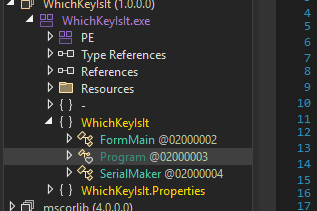
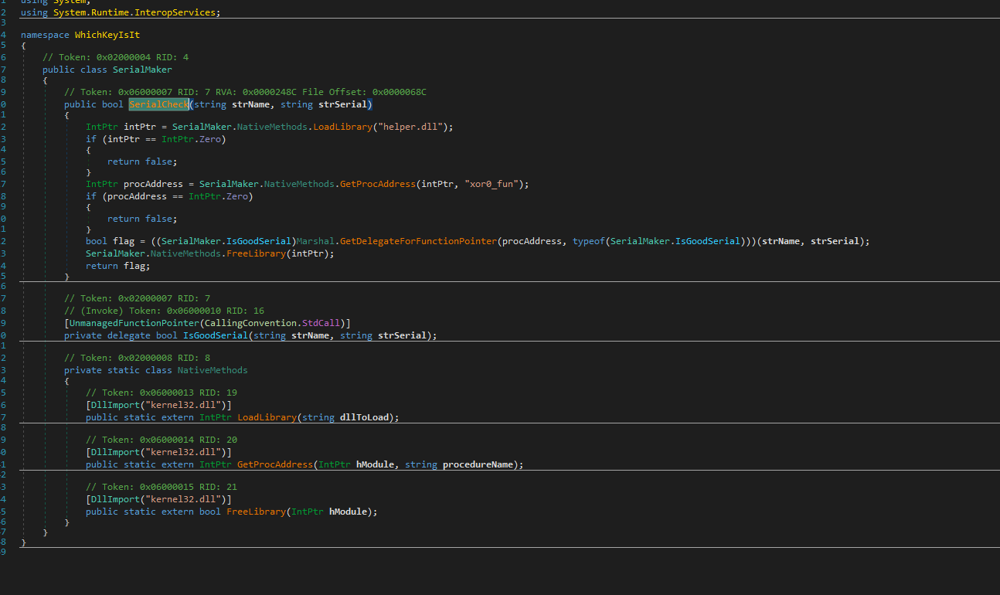
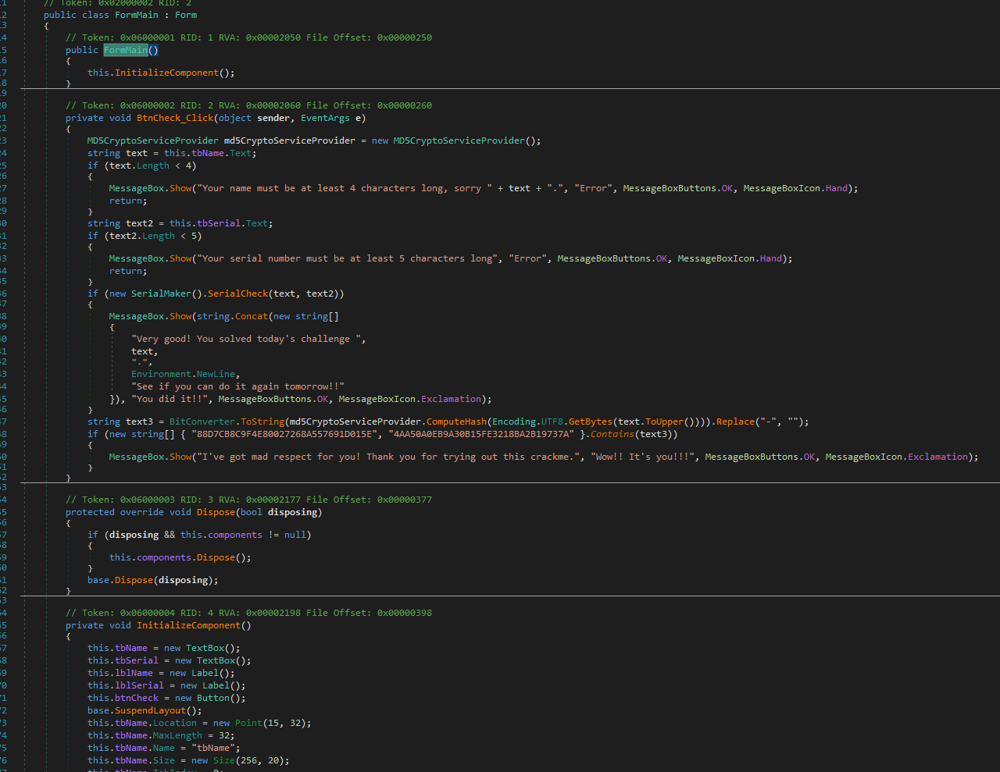
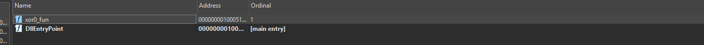

# WeekDaysBased Crackme — one binary, seven day-dispatched sub-challenges

> A single binary that behaves like seven crackmes. A .NET managed front (`WeekDaysBased_Crackme.exe`, internal assembly `WhichKeyIsIt`) forwards the check to a native C/C++ helper (`helper.dll`), whose export `xor0_fun` reads the current day of week and runs a **different** validation routine for each weekday. The sub-writeups below each cover one weekday's challenge — every one uses the *same* binary; only the active weekday differs.

## The host (managed shell)

`WeekDaysBased_Crackme.exe` (namespace `WhichKeyIsIt`, window "Which Key Is It v0.01") is a thin WinForms shell. `FormMain.BtnCheck_Click` enforces two length gates — name ≥ 4, serial ≥ 5 — then delegates the real decision to native code:

```csharp
// SerialMaker.SerialCheck(strName, strSerial)
IntPtr h = LoadLibrary("helper.dll");
IntPtr p = GetProcAddress(h, "xor0_fun");
bool ok = ((IsGoodSerial)Marshal.GetDelegateForFunctionPointer(p, typeof(IsGoodSerial)))(strName, strSerial);
FreeLibrary(h);
return ok;
// [UnmanagedFunctionPointer(CallingConvention.StdCall)] delegate bool IsGoodSerial(string strName, string strSerial);
```

So a .NET decompiler shows only the shell; `helper.dll` is native C/C++ and is read in IDA. There is also a cosmetic easter egg in `BtnCheck_Click`: if `MD5(name.ToUpper())` equals one of two hardcoded digests (`88D7CB8C9F4E80027268A557691D015E`, `4AA50A0EB9A30B15FE3218BA2B19737A`) it prints a "mad respect" message — MD5 is one-way, so this is flavor, not part of any day's solution.





## The dispatcher (native helper)

`helper.dll` exports one function, `xor0_fun` (ordinal 1). It calls `GetLocalTime`, reads `SYSTEMTIME.wDayOfWeek` (offset `+4`), and branches to one of seven handlers:

```asm
call GetLocalTime
mov  al, [SystemTime+4]        ; wDayOfWeek
cmp  al, 0  / jz monday_loc
cmp  al, 1  / jz tuesday_loc
cmp  al, 2  / jz wednesday_loc
cmp  al, 3  / jz thursday_loc
cmp  al, 4  / jz friday_loc
cmp  al, 5  / jz saturday_loc
cmp  al, 6  / jz sunday_loc
```



**Naming note.** The seven branches are *labelled* `monday`…`sunday` in analysis, but those are branch labels, not calendar claims. Windows numbers `wDayOfWeek` as `0 = Sunday … 6 = Saturday`, so the branch labelled `monday` is dispatch index `0` (which actually fires on Sunday), and the offset carries through. Reaching a given branch to test it requires the system clock to be on the corresponding weekday (or forcing the dispatch). Each sub-writeup below refers to its branch by the analysis label.

## Sub-challenges (same binary, independent logic)

| # | Branch | Writeup | Status |
|---|--------|---------|--------|
| 1 | Monday | [Plaintext serial (A-10 Warthog)](WeekDaysBasedCrackme_Monday_sub_writeup_1/Monday_Plaintext_Serial.md) | solved |
| 2 | Tuesday | [External 32-byte file constraint (`xor0.rox`)](WeekDaysBasedCrackme_Tuesday_sub_writeup_2/Tuesday_External_File_Constraint.md) | solved |
| 3 | Wednesday | [Machine-specific `T10-` suffix](WeekDaysBasedCrackme_Wednesday_sub_writeup_3/Wednesday_Machine_Specific_Suffix.md) | solved |
| 4 | Thursday | [Uppercase-hex serial](WeekDaysBasedCrackme_Thursday_sub_writeup_4/Thursday_Uppercase_Hex_Serial.md) | solved |
| 5 | Friday | [MD5(username) == serial (XOR-obfuscated)](WeekDaysBasedCrackme_Friday_sub_writeup_5/Friday_MD5_Serial.md) | solved |
| 6 | Saturday | [Adler-32 + numeric constraints (keygen)](WeekDaysBasedCrackme_Saturday_sub_writeup_6/Saturday_Adler32_Numeric_Constraints.md) | solved |
| 7 | Sunday | [Crypto decoy over a plain memcmp](WeekDaysBasedCrackme_Sunday_sub_writeup_7/Sunday_Crypto_Decoy_Memcmp.md) | solved |

## Binaries

Each sub-folder's `Binary/` holds the shared set:
- `WeekDaysBased_Crackme.exe` — managed shell (internal assembly `WhichKeyIsIt`)
- `helper.dll` — native C/C++ helper exporting `xor0_fun`
- `xor0.rox` — the 32-byte data file used by the Tuesday branch; **not shipped by the crackme — the solver creates it** (see the Tuesday writeup)
- `xor0_crackme_1.nfo` — release note
