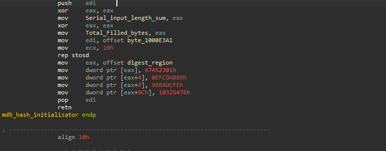
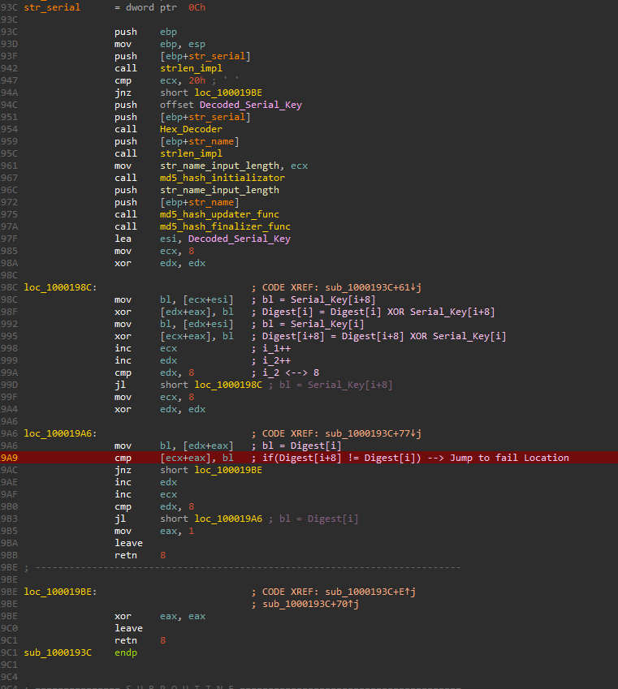
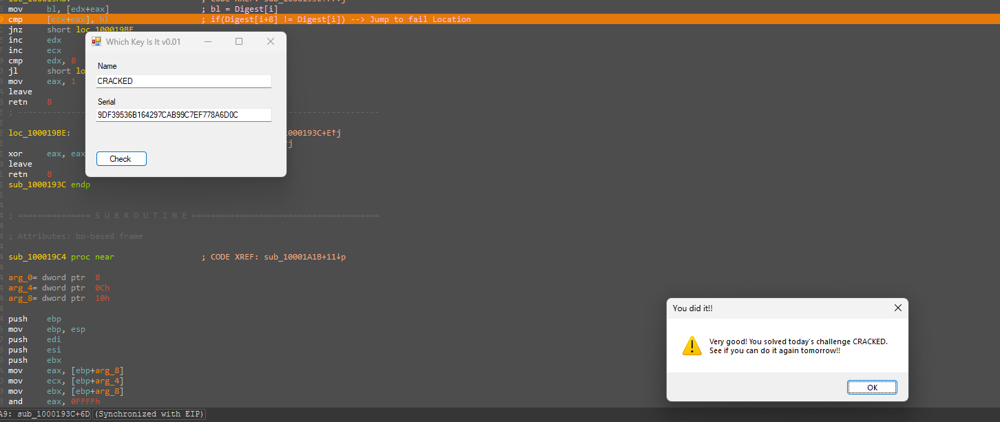
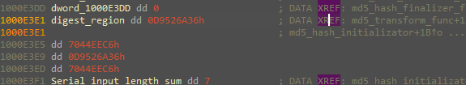

# WeekDaysBased Crackme — Friday sub-challenge (MD5(username) == serial)

> One of seven day-dispatched sub-challenges inside the same binary (see the [category overview](../README.md)). The Friday branch hashes the username with MD5 and compares it to the serial — but wraps the comparison in a paired-XOR "obfuscation" that, once reduced with basic algebra, is just `digest == serial`. Because MD5 runs forward, this yields a real keygen: `serial = uppercase-hex MD5(username)`.

## Metadata

| Field        | Value |
|--------------|-------|
| Source       | Local archive — `xor0_crackme_1` (WeekDaysBased Crackme) |
| Language     | .NET managed shell (`WhichKeyIsIt`) + native C/C++ helper (`helper.dll`) |
| Architecture | x86 (32-bit) |
| Platform     | Windows |
| Branch       | `friday` handler (dispatch index 4) |
| Difficulty   | 3.5 / 6 (self-assessed) |
| Quality      | 4.0 / 6 (self-assessed) |
| Date solved  | 2026-09-30 |
| Time spent   | ~1h |
| Tools        | dnSpy, IDA Pro (local Windows debugger) |
| Solve type   | keygen (`serial = uppercase-hex MD5(username)`) |

## 1. Goal

With the `friday` branch active, a name plus its correct 32-character serial prints the success message. The objective is a general rule for the serial.

## 2. Host recap

The managed shell forwards to `helper.dll!xor0_fun`, dispatched on `wDayOfWeek`; see the [category overview](../README.md). This writeup covers the `friday` handler.

## 3. Static Analysis

The handler decodes the serial, hashes the name with MD5, then runs the obfuscated comparison:

```asm
push [ebp+str_serial]; call strlen_impl
cmp  ecx, 20h / jnz fail            ; serial must be 32 chars
push offset Decoded_Serial_Key
push [ebp+str_serial]
call Hex_Decoder                    ; 32 hex chars -> 16 bytes  S[0..15]
...
call md5_hash_initializator         ; state = MD5 IVs
call md5_hash_updater_func          ; Update(name, len)
call md5_hash_finalizer_func        ; D[0..15] = MD5(name)
```

**MD5 recognition.** `md5_hash_initializator` seeds the state with the four MD5 initialization words — the unmistakable fingerprint (recognize, don't trace):

```asm
dword [eax]    = 0x67452301
dword [eax+4]  = 0xEFCDAB89
dword [eax+8]  = 0x98BADCFE
dword [eax+0Ch]= 0x10325476
```



Every MD5/SHA implementation is the same three-call skeleton — **Init → Update → Final** — and should be treated as a black box: the 4 IVs above plus the 64 sine T-constants and 4 rounds in Update are MD5; a 16-byte digest confirms it. (SHA-1 = 5 IVs `…+0xC3D2E1F0`, 20-byte digest; SHA-256 = 8 IVs `0x6A09E667…`, 32-byte digest.)

**The "obfuscated" comparison.** With `D = MD5(name)` (16 bytes) and `S = decoded serial` (16 bytes), the handler mangles the two halves, then compares them:

```asm
; loop i = 0..7:
D[i]   ^= S[i+8]
D[i+8] ^= S[i]
; loop i = 0..7:
cmp D[i+8], D[i] / jnz fail          ; require D[i+8] == D[i]
mov eax, 1                            ; success
```



## 4. The Core Insight

The XOR pass is theatre. Substituting the mangled values into the equality check, for each `i` in `0..7`:

```
D[i+8] ^ S[i]  ==  D[i] ^ S[i+8]
⇒  D[i] ^ D[i+8]  ==  S[i] ^ S[i+8]
```

Setting `S = D` satisfies this for every index (both sides collapse to `D[i] ^ D[i+8]`). Since the serial is fully attacker-controlled, the intended and guaranteed solution is simply `S = D` — i.e. **the serial's 16 bytes equal the MD5 digest of the username.** No inversion is needed: MD5 runs forward, so the serial is computed directly from the name.

One parsing constraint carries over from elsewhere in this binary: `Hex_Decoder` maps `'0'–'9'` and `'A'–'F'` but has **no lowercase branch** (`-0x57` is absent), so the serial must be entered in **uppercase** hex.

## 5. Solution (keygen)

**Rule:** `serial = MD5(username)` rendered as 32 **uppercase** hex characters.

Example — username `CRACKED`:

```
MD5("CRACKED") = 9DF39536B164297CAB99C7EF778A6D0C
```

- **Name:** `CRACKED`
- **Serial:** `9DF39536B164297CAB99C7EF778A6D0C`



Keygen, one line:

```python
import hashlib
serial = hashlib.md5(username.encode()).hexdigest().upper()
```

```powershell
$md5=[System.Security.Cryptography.MD5]::Create()
(($md5.ComputeHash([Text.Encoding]::ASCII.GetBytes($name))|%{$_.ToString("X2")}) -join '')
```

The digest for `CRACKED` was also confirmed in memory at the check (matching the value above).



## 6. Key Takeaways

- **Recognize hashes by their skeleton, don't read them.** Init → Update → Final with the MD5 IVs (`0x67452301 / 0xEFCDAB89 / 0x98BADCFE / 0x10325476`) and a 16-byte output is MD5. Confirm the family from the IVs and digest size; never trace the round function.
- **XOR "obfuscation" is often just algebra.** Paired operations like `D[i]^=S[i+8]; D[i+8]^=S[i]` followed by an equality test reduce to a simple relation; solving `S = D` here turns a scary-looking check into a one-line keygen.
- **Serial = digest ⇒ real keygen.** When the check is `serial == H(name)` and `H` runs forward, every username has a computable serial — unlike a `H(input) == const` gate, which would be one-way and un-keygennable.
- **Match the hex parser's case.** `Hex_Decoder` accepts only uppercase `A–F` (no `-0x57`), a quirk shared with this binary's Thursday branch — lowercase serials silently fail.

## 7. Artifacts

- **Keygen rule:** `serial = uppercase-hex MD5(username)`
- **Verified pair:** `CRACKED` / `9DF39536B164297CAB99C7EF778A6D0C`
- **Reduction:** `D[i+8]^S[i] == D[i]^S[i+8]  ⇒  D^D[i+8] == S^S[i+8]`, satisfied by `S = D`
- **Hash:** MD5 (IVs `0x67452301/0xEFCDAB89/0x98BADCFE/0x10325476`, 16-byte digest)
- **Parser:** `Hex_Decoder` — uppercase hex only (no lowercase `-0x57` branch)
- **Branch:** `friday` handler (dispatch index 4)
- **Binary:** `Binary/WeekDaysBased_Crackme.exe` (+ `helper.dll`)
