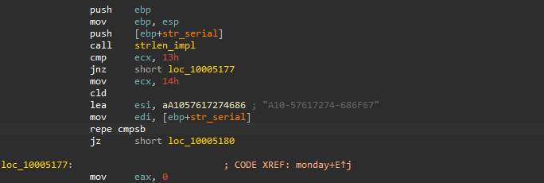
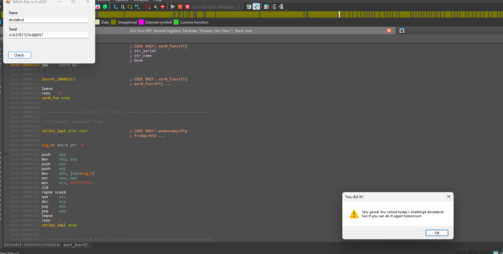

# WeekDaysBased Crackme — Monday sub-challenge (plaintext serial)

> One of seven day-dispatched sub-challenges inside the same binary (see the [category overview](../README.md)). The Monday branch ignores the username entirely and compares the serial, byte for byte, against a hardcoded 19-character string — which spells "A-10 Warthog" in hex.

## Metadata

| Field        | Value |
|--------------|-------|
| Source       | Local archive — `xor0_crackme_1` (WeekDaysBased Crackme) |
| Language     | .NET managed shell (`WhichKeyIsIt`) + native C/C++ helper (`helper.dll`) |
| Architecture | x86 (32-bit) |
| Platform     | Windows |
| Branch       | `monday` handler (dispatch index 0) |
| Difficulty   | 1.0 / 6 (self-assessed) |
| Date solved  | 2026-09-18 |
| Time spent   | ~5 min |
| Tools        | dnSpy, IDA Pro |
| Solve type   | password (plaintext) |

## 1. Goal

On the day the `monday` branch is active, entering a name (≥ 4 chars) and the correct serial prints `Very good! You solved today's challenge …`. The objective is the serial.

## 2. Host recap

The managed `WeekDaysBased_Crackme.exe` forwards to `helper.dll!xor0_fun`, which dispatches on `wDayOfWeek` to per-weekday handlers. Full architecture is in the [category overview](../README.md). This writeup covers the `monday` handler only.

## 3. Static Analysis

The `monday` handler is a fixed-string comparison:

```asm
push [ebp+str_serial]
call strlen_impl
cmp  ecx, 13h                 ; serial length must be 0x13 = 19
jnz  fail
mov  ecx, 14h                 ; 20 bytes (19 + NUL)
cld
lea  esi, "A10-57617274-686F67"
mov  edi, [ebp+str_serial]
repe cmpsb                    ; serial == "A10-57617274-686F67"
jz   success
fail:
mov  eax, 0
```



The username is never referenced in this branch; only the shell's `name ≥ 4` gate applies to it.

A small flourish in the constant: the hex groups decode to ASCII —
`57 61 72 74` = `Wart`, `68 6F 67` = `hog` — so `A10-57617274-686F67` reads as **A10-Wart-hog** (the A-10 Warthog).

## 4. Solution

- **Serial:** `A10-57617274-686F67` (any name of at least 4 characters).



## 5. Key Takeaways

- **Fixed-string `repe cmpsb`** preceded by a length `cmp` is the simplest serial check there is: the length gate reveals the exact length (19), and the referenced string literal is the answer.
- **Not everything checked in the UI is checked in the logic.** The shell requires a name, but the `monday` branch ignores it — reading the native handler, not the form, is what tells the truth.
- **Read magic constants as bytes.** The "random" hex `57617274-686F67` is ASCII "Warthog"; decoding constant bytes to ASCII often reveals author intent.

## 6. Artifacts

- **Serial:** `A10-57617274-686F67` (length 19); username: any ≥ 4 chars
- **Branch:** `monday` handler (dispatch index 0), fixed-string `repe cmpsb`
- **Constant decoded:** `A10-` + `"Wart"` + `-` + `"hog"` = A-10 Warthog
- **Binary:** `Binary/WeekDaysBased_Crackme.exe` (+ `helper.dll`)
