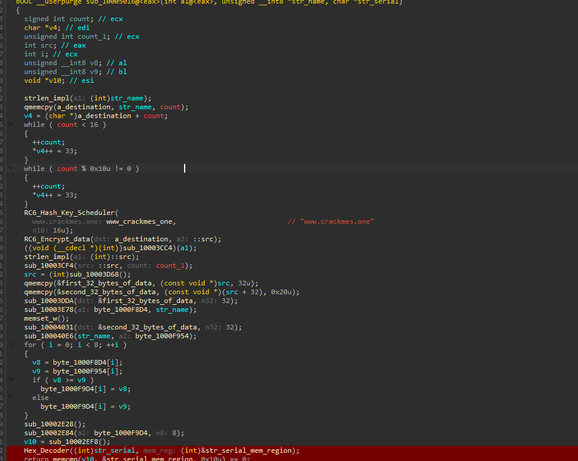
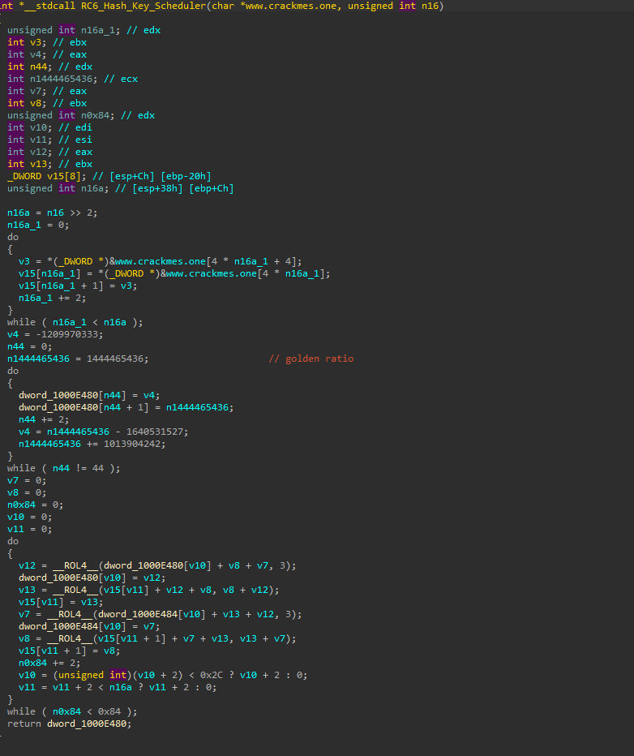
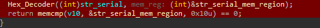
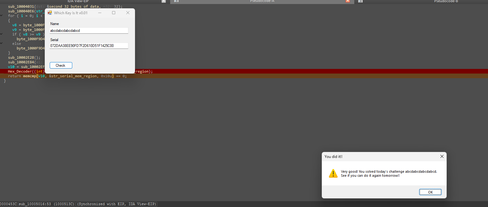

# WeekDaysBased Crackme — Sunday sub-challenge (crypto decoy over a plain memcmp)

> The last of seven day-dispatched sub-challenges in the same binary (see the [category overview](../README.md)). The Sunday branch looks like a serious crypto problem — an RC6 key schedule keyed with `"www.crackmes.one"`, RC6 encryption, and a chain of hashing transforms — but all of it feeds a single `memcmp(computed_value, serial, 16)`. None of the crypto has to be reversed: the 16-byte target is sitting in memory at the comparison, so the serial is just that value in hex.

## Metadata

| Field        | Value |
|--------------|-------|
| Source       | Local archive — `xor0_crackme_1` (WeekDaysBased Crackme) |
| Language     | .NET managed shell (`WhichKeyIsIt`) + native C/C++ helper (`helper.dll`) |
| Architecture | x86 (32-bit) |
| Platform     | Windows |
| Branch       | `sunday` handler (dispatch index 6) |
| Difficulty   | 3.0 / 6 (self-assessed) |
| Quality      | 4.5 / 6 (self-assessed) |
| Date solved  | 2026-10-06 |
| Time spent   | ~45 min |
| Tools        | dnSpy, IDA Pro (local Windows debugger) |
| Solve type   | dynamic recovery (read the compared value at the memcmp) |

## 1. Goal

With the `sunday` branch active, a name plus the correct serial prints the success message. The objective is the serial for a chosen name.

## 2. Host recap

The managed shell forwards to `helper.dll!xor0_fun`, dispatched on `wDayOfWeek`; see the [category overview](../README.md). This writeup covers the `sunday` handler.

## 3. Static Analysis

The handler (`sub_10005016`) does a lot of work before it decides anything:

```c
strlen(str_name);
qmemcpy(a_destination, str_name, count);
while (count < 16)      { a_destination[count++] = 0x21; }   // pad with '!' to >= 16
while (count % 16 != 0) { a_destination[count++] = 0x21; }   // pad to a 16-byte multiple

RC6_Hash_Key_Scheduler("www.crackmes.one", 16);             // key schedule, key = "www.crackmes.one"
RC6_Encrypt_data(a_destination, src);                        // RC6-encrypt the padded name
... several transforms over the ciphertext (two 32-byte halves, hashing subs) ...
for (i = 0; i < 8; ++i)                                       // byte-wise max() of two 8-byte arrays
    byte_1000F9D4[i] = max(byte_1000F8D4[i], byte_1000F954[i]);
... more transforms ...
v10 = sub_10002EF8();                                         // final 16-byte value

Hex_Decoder(str_serial, &str_serial_mem_region);              // decode the serial hex -> bytes
return memcmp(v10, &str_serial_mem_region, 0x10) == 0;        // <-- the entire decision
```

**The crypto is a decoy.** `RC6_Hash_Key_Scheduler` is recognizable as RC5/RC6 from its golden-ratio key-schedule constants and variable-rotation rounds, and there is a whole pipeline of hashing transforms after it. But everything funnels into one line: `memcmp(v10, decoded_serial, 16)`. The serial is never transformed — it is only hex-decoded and compared. So the accepted serial is simply `v10` rendered as hex.





## 4. The Core Insight

The shape `memcmp(computed, input)` is the whole game. When the program computes a value and then compares your input against it, the value is present in memory at the moment of the compare — so there is no reason to reverse the RC6, the key schedule, or any of the hashing. Recognize the pattern, break on the `memcmp`, and read the 16 bytes. Most of the 45 minutes here went into *not* getting pulled into the RC6 rabbit hole; the actual solve is five minutes once the final comparison is located.

## 5. Solution (dynamic recovery)

Breaking on `memcmp(v10, &str_serial_mem_region, 0x10)` and reading `v10` (16 bytes) gives the target directly. For the name `abcdabcdabcdabcd`:

- **Name:** `abcdabcdabcdabcd`
- **Serial:** `072DAA38EE90FD7F2D610D51F1425C00`  (the 16 bytes of `v10`, in hex)



`v10` is derived from the username, so the serial is per-name; a full keygen would mean reimplementing the entire RC6-plus-transforms pipeline, which buys nothing here because the program computes `v10` for any name you enter — reading it at the compare is the efficient path.

## 6. Key Takeaways

- **Recognize crypto used as a decoy.** A `memcmp(computed, input)` gate means the answer exists in memory at the comparison. Identify the cipher only well enough to know it is *not* the point, then read the target at the `memcmp` instead of reversing it.
- **RC5/RC6 tell.** The golden-ratio key-schedule constants plus variable (data-dependent) rotations mark RC5/RC6. Here, recognizing it was sufficient — no reimplementation needed.
- **Know where the decision lives.** The difficulty was resisting the rabbit hole; the entire verdict is one line at the bottom of the function. Finding that line first would have collapsed the whole challenge immediately.

## 7. Artifacts

- **Serial (for `abcdabcdabcdabcd`):** `072DAA38EE90FD7F2D610D51F1425C00`
- **Decision:** `memcmp(v10, Hex_Decode(serial), 16) == 0`; serial = hex of the computed 16-byte `v10`
- **Decoy pipeline:** name padded with `'!'` to a 16-byte multiple → RC6 (key `"www.crackmes.one"`) → hashing transforms → byte-wise `max()` → `v10`
- **Recovery:** break on the `memcmp`, read the 16 bytes of `v10`
- **Branch:** `sunday` handler (dispatch index 6)
- **Binary:** `Binary/WeekDaysBased_Crackme.exe` (+ `helper.dll`)
