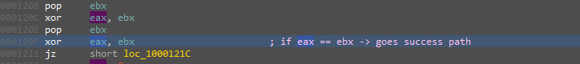
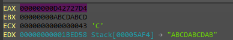
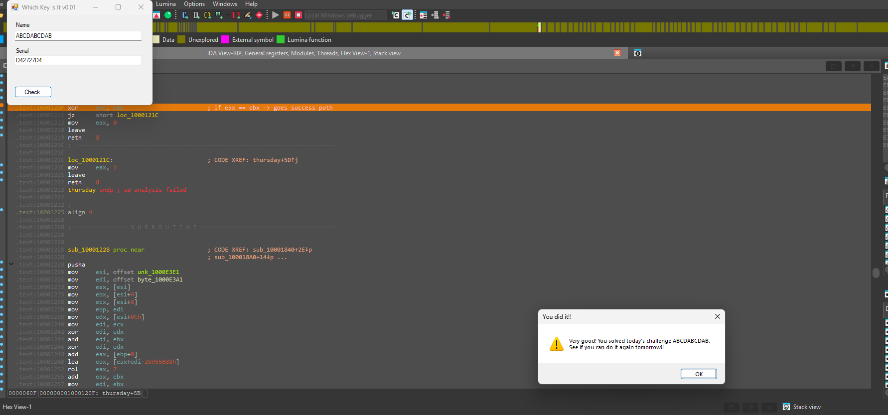

# WeekDaysBased Crackme — Thursday sub-challenge (uppercase-hex serial)

> One of seven day-dispatched sub-challenges inside the same binary (see the [category overview](../README.md)). The Thursday branch parses the serial as an 8-digit hex value and compares it to a value computed from the username. Its hex parser handles uppercase `A–F` and digits `0–9` but **not** lowercase — so the serial must be uppercase hex. The target value was recovered dynamically for a chosen input.

## Metadata

| Field        | Value |
|--------------|-------|
| Source       | Local archive — `xor0_crackme_1` (WeekDaysBased Crackme) |
| Language     | .NET managed shell (`WhichKeyIsIt`) + native C/C++ helper (`helper.dll`) |
| Architecture | x86 (32-bit) |
| Platform     | Windows |
| Branch       | `thursday` handler (dispatch index 3) |
| Difficulty   | 3.0 / 6 (self-assessed) |
| Date solved  | 2026-09-27 |
| Time spent   | ~30 min |
| Tools        | dnSpy, IDA Pro (local Windows debugger) |
| Solve type   | password (dynamic recovery for a chosen input) |

## 1. Goal

With the `thursday` branch active, a name plus the correct 8-character hex serial prints the success message. The objective is that serial for a chosen name.

## 2. Host recap

The managed shell forwards to `helper.dll!xor0_fun`, dispatched on `wDayOfWeek`; see the [category overview](../README.md). This writeup covers the `thursday` handler.

## 3. Static Analysis

The serial is converted from ASCII hex to a 32-bit integer, then compared to a value derived from the username:

```asm
; per hex character of the serial:
;   '0'..'9'  ->  c - 0x30
;   'A'..'F'  ->  c - 0x37        (uppercase hex)
;   (no  c - 0x57  case)          ->  lowercase a..f is NOT handled
...
pop  ebx
xor  eax, ebx
pop  ebx
xor  eax, ebx        ; success when the accumulated value equals the computed target
jz   success
```



The missing `-0x57` branch is the crux of the parser: lowercase `a–f` are not mapped to `10–15`, so a lowercase serial is mis-decoded and can never match. The serial must therefore be **uppercase hex** (`0–9`, `A–F`).

## 4. Solution (dynamic recovery)

Breaking at the comparison reveals the expected 32-bit value in `EAX`. For the username `ABCDABCDAB`:

- `EAX = 0xD42727D4` (the target)
- `EBX = 0xABCDABCD` (intermediate name hash)
- `EDX → "ABCDABCDAB"`



The serial is just that target rendered as uppercase hex:

- **Serial:** `D42727D4`



> The full username→value function was not reversed; for a single chosen name the target is read directly at the compare (low-effort, sufficient). A complete keygen would require reversing that derivation, which offered no additional value here.

## 5. Key Takeaways

- **Inspect the hex parser's case handling.** A converter with `-0x30` and `-0x37` but no `-0x57` silently rejects lowercase `a–f`; feeding lowercase produces garbage and an unsolvable-looking result. Matching the parser's expected case is a prerequisite, not a detail.
- **Serial = target as text.** When the check compares a parsed integer to a computed value, the serial is simply that value in the parser's own format (here, uppercase hex).
- **Recover the target at the compare.** Reading `EAX` at the comparison yields the answer for a chosen input without reversing the entire hash — the pragmatic choice for a practice binary.

## 6. Artifacts

- **Serial (for `ABCDABCDAB`):** `D42727D4`
- **Parser:** ASCII-hex → u32; `'0'–'9'` via `-0x30`, `'A'–'F'` via `-0x37`; **no lowercase** handling (uppercase hex required)
- **Recovery:** break at the compare; target in `EAX` (`0xD42727D4`), name hash in `EBX` (`0xABCDABCD`)
- **Branch:** `thursday` handler (dispatch index 3)
- **Binary:** `Binary/WeekDaysBased_Crackme.exe` (+ `helper.dll`)
