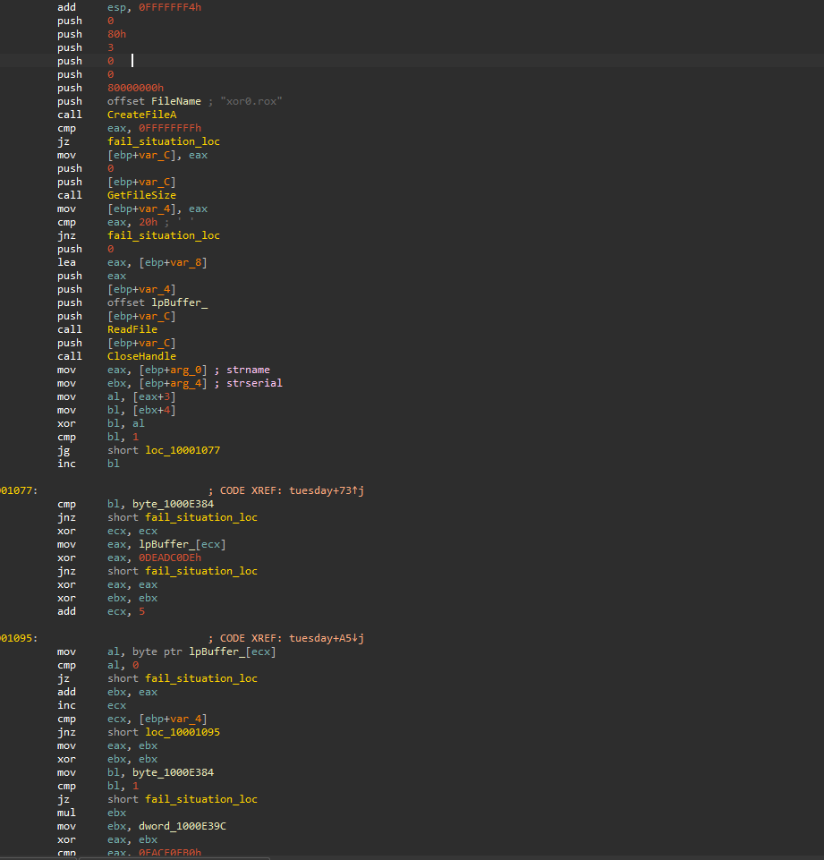
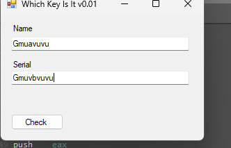
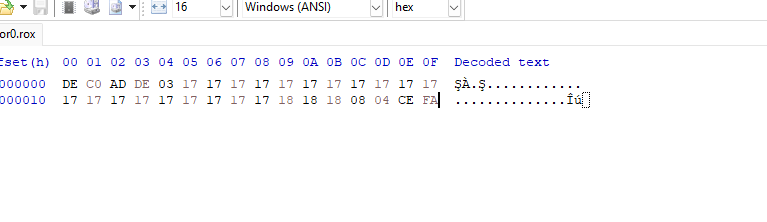
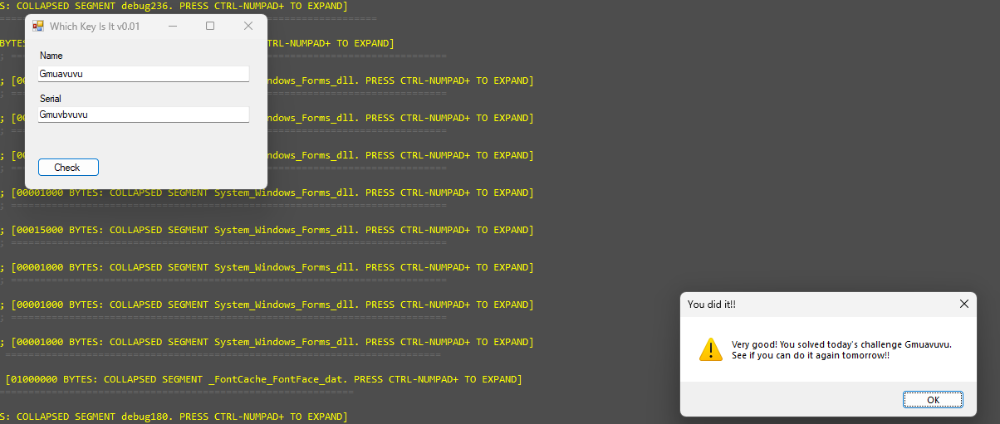

# WeekDaysBased Crackme — Tuesday sub-challenge (external 32-byte file constraint)

> One of seven day-dispatched sub-challenges inside the same binary (see the [category overview](../README.md)). The Tuesday branch couples three inputs — the username, the serial, and an **external 32-byte file `xor0.rox` that the solver must create** — through a small arithmetic constraint system ending in `(sum × K) ⊕ last4 == 0xFACE0FB0`.

## Metadata

| Field        | Value |
|--------------|-------|
| Source       | Local archive — `xor0_crackme_1` (WeekDaysBased Crackme) |
| Language     | .NET managed shell (`WhichKeyIsIt`) + native C/C++ helper (`helper.dll`) |
| Architecture | x86 (32-bit) |
| Platform     | Windows |
| Branch       | `tuesday` handler (dispatch index 1) |
| Difficulty   | 2.5 / 6 (self-assessed) |
| Date solved  | 2026-09-21 |
| Time spent   | ~45 min |
| Tools        | dnSpy, IDA Pro, a hex editor |
| Solve type   | constraint craft (name + serial + external file) |

## 1. Goal

With the `tuesday` branch active, a valid name/serial pair **plus** a correctly-formed `xor0.rox` file next to the executable prints the success message. The objective is a set of inputs that satisfies every constraint.

## 2. Host recap

The managed shell forwards to `helper.dll!xor0_fun`, dispatched on `wDayOfWeek`; see the [category overview](../README.md). This writeup covers the `tuesday` handler.

## 3. Static Analysis

The handler reads an external file and validates it against the name/serial:

```asm
CreateFileA("xor0.rox", GENERIC_READ, ...)     ; file must exist
cmp eax, -1 / jz fail
GetFileSize -> eax
cmp eax, 20h / jnz fail                          ; file must be exactly 32 bytes
ReadFile -> lpBuffer (32 bytes) ; CloseHandle

al = strname[3]                                  ; 4th char of name
bl = strserial[4]                                ; 5th char of serial
xor bl, al                                       ; K = name[3] ^ serial[4]
cmp bl, 1 / jg  keep
inc bl                                           ; if K <= 1, K++
keep:
cmp bl, byte lpBuffer[4] / jnz fail              ; file[4] must equal K

mov eax, dword lpBuffer[0]
xor eax, 0DEADC0DEh / jnz fail                   ; file[0..3] == DE C0 AD DE  (0xDEADC0DE)

xor ebx, ebx ; ecx = 5
sum_loop:
  al = lpBuffer[ecx]
  cmp al, 0 / jz fail                            ; bytes 5..31 must all be non-zero
  add ebx, eax                                   ; ebx = sum(file[5..31])
  inc ecx ; cmp ecx, filesize(32) / jnz sum_loop

mov eax, ebx                                     ; eax = sum
bl  = lpBuffer[4]                                ; K
cmp bl, 1 / jz fail                              ; file[4] != 1
mul ebx                                          ; eax = sum * K
mov ebx, dword lpBuffer[28]                      ; last 4 bytes (file[28..31], little-endian)
xor eax, ebx
cmp eax, 0FACE0FB0h                              ; (sum * K) ^ last4 == 0xFACE0FB0
```



**The constraint set**, restated:
1. `xor0.rox` exists, is exactly **32 bytes**.
2. `file[0..3] = DE C0 AD DE` (`0xDEADC0DE`, little-endian).
3. `K = name[3] ^ serial[4]`; if `K ≤ 1`, `K += 1`. Then `file[4] == K`, and `file[4] != 1`.
4. Every byte `file[5..31]` is non-zero; let `S = sum(file[5..31])`.
5. `(S × K) ⊕ (file[28..31] as u32 LE) == 0xFACE0FB0`.

## 4. Solution

Because `xor0.rox` is not shipped, the solve is to **author all three artifacts together** so the arithmetic closes. A verified satisfying set:

- **Name:** `Gmuavuvu`  → `name[3] = 'a' = 0x61`
- **Serial:** `Gmuvbvuvu` → `serial[4] = 'b' = 0x62`  ⇒ `K = 0x61 ^ 0x62 = 0x03`
- **`xor0.rox` (32 bytes):**
  ```
  DE C0 AD DE 03 17 17 17 17 17 17 17 17 17 17 17
  17 17 17 17 17 17 17 17 17 18 18 18 08 04 CE FA
  ```

Checks: `file[4] = 0x03 = K` (and `≠ 1`); header `DEADC0DE`; all of `file[5..31]` non-zero; `S = sum(file[5..31]) = 1000`; `last4 = file[28..31] = 08 04 CE FA = 0xFACE0408`; and `(1000 × 3) ⊕ 0xFACE0408 = 0x00000BB8 ⊕ 0xFACE0408 = 0xFACE0FB0`. ✔





## 5. Key Takeaways

- **The "serial" can live outside the process.** A `CreateFileA` on a fixed filename that the program never creates itself is a signal that the solver is expected to *supply* that file — check for external inputs before assuming everything is in the text boxes.
- **Couple the free variables deliberately.** Three inputs feed one equation; fixing `K` from the name/serial pins `file[4]`, then the tail bytes are tuned to land the final XOR. Solving it is bookkeeping once the constraints are enumerated.
- **`(sum × K) ⊕ last4 == const`** is a satisfiable-by-construction check: pick the body, compute the sum, then choose the last four bytes to force the target — no inversion of a one-way function required.

## 6. Artifacts

- **Name / serial:** `Gmuavuvu` / `Gmuvbvuvu` (⇒ `K = 3`)
- **`xor0.rox` (32 bytes):** `DE C0 AD DE 03` + `17×20` + `18 18 18` + `08 04 CE FA`
- **Constraints:** 32-byte file · `DEADC0DE` header · `file[4] == K != 1` · `file[5..31]` non-zero · `(sum(5..31) × K) ⊕ file[28..31] == 0xFACE0FB0`
- **Branch:** `tuesday` handler (dispatch index 1)
- **Binary:** `Binary/WeekDaysBased_Crackme.exe` (+ `helper.dll`); create `xor0.rox` beside it
